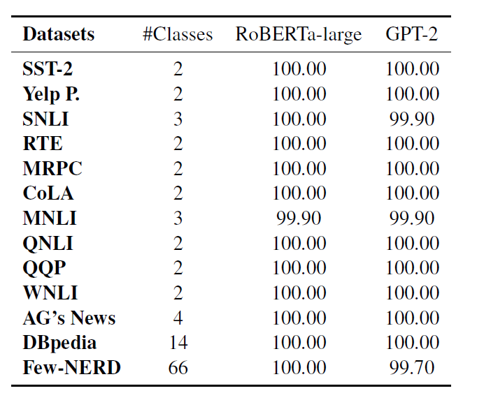
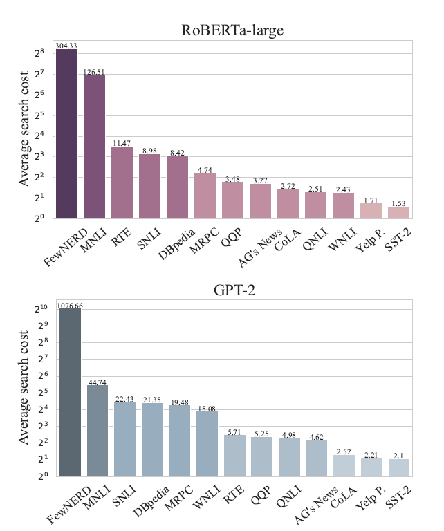
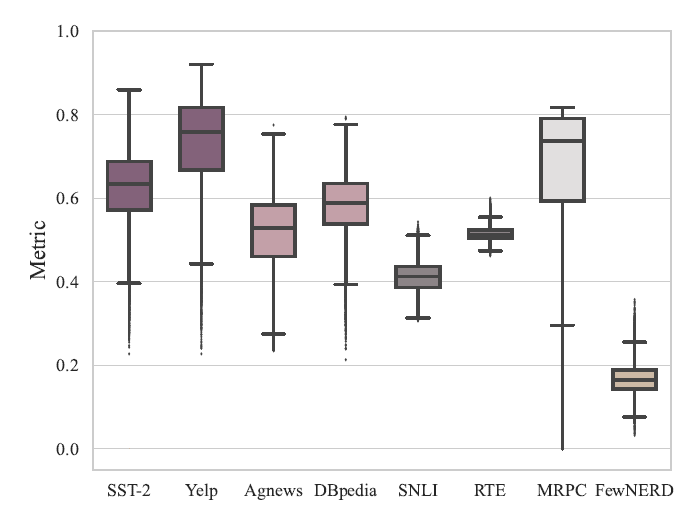
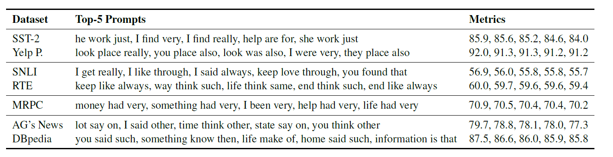
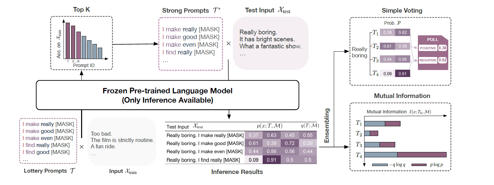
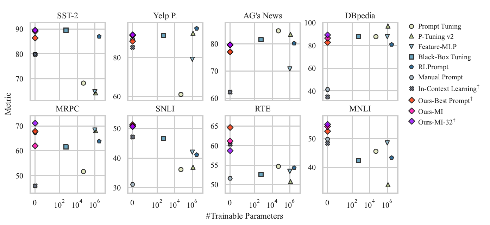
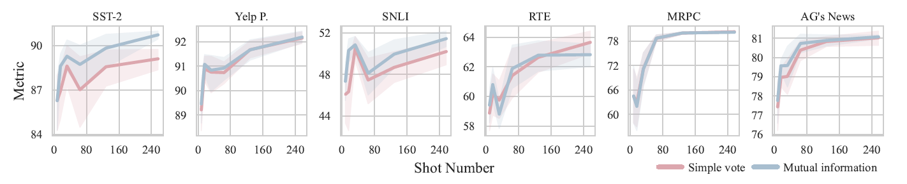
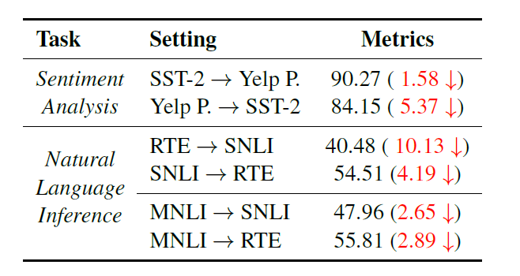

# Exploring Lottery Prompts for Pre-trained Language Models

> 太长不看版
>
>这项研究探索了在无需优化的情况下，每个单独实例的“幸运提示（Lottery Prompts）”在各种分类任务中的应用。作者提出了一个由常用词组成的大型提示空间作为搜索空间，以验证是否每个实例都存在能够引导预训练语言模型（PLM）进行正确预测的特定提示。实验结果表明，在少样本设置下，这种方法在各种自然语言处理任务上取得了满意的结果。作者发现，几乎每个实例都有一个"幸运提示"，且搜索成本较低。此外，某些强提示在整个训练集上表现出色，并且可以泛化到未见数据，展示了集成强提示的有效性。同时，通过一些提示的集成方法，将这些强提示进行集成，可以优化PLM在特定任务上的泛化能力。这项工作表明，PLM的潜力可以通过挖掘其词汇库中的纯文本提示来成功地利用，而无需参数优化。

## 摘要

一贯地扩展预训练语言模型（Pre-trained Language Models，PLM）对模型适应性提出了重大挑战，需要更高效的方法来替代传统的微调方法。作者注意到在zero-shot任务中使用提示词（Prompts）可以提高性能表现，但不同的提示词带来的差异很大。因此，作者研究了实例级的提示以及它们的泛化能力。通过提示词搜索空间，作者发现几乎每个实例都存在一个能够引导PLM进行正确预测的“幸运提示”，而且这些提示的搜索成本较低。有些“幸运提示”能够在整个训练集上表现出色，并具有独特的语言特征。最后，作者尝试将这些强大的幸运提示泛化到未见的数据，而无需进行参数调整。实验结果表明，这种方法在不同自然语言处理分类任务上可以获得与其他无梯度和无优化的基线方法可比较的结果。

## 引言

自从预训练语言模型（PLM）成为现代自然语言处理研究的标准以来，预训练微调范式一直占主导地位。直到近年来，随着模型规模的不断扩展，优化成本变得异常高昂。因此，研究人员提出了使用提示词的方法。这种方法通过添加额外的上下文信息来触发所需的输出，在各种任务中表现出色，甚至在没有足够标注数据的情况下也能有效。然而，不同提示之间的性能波动问题仍然存在。鉴于提示方法的敏感性和上下文依赖性，作者提出了一个大胆的假设，即：是否可能在不进行任何优化的情况下，为每个数据点找到适用的实例级别提示，以确保正确的输出。

作者通过在13个代表性的分类数据集上构建一个具有合理搜索空间的自动搜索过程，进行了实证研究，其中包括多达66个类别的数据集，从而验证了这种“幸运提示”的存在。也就是说，仅使用少数离散token的组合可以使PLM为几乎任何分类数据输出正确的结果。这一发现更新了PLM中提示知识限制的认识，并展示了PLM推理能力的潜在上限。

在验证了假设后，作者对“幸运提示”的内部机制和特性进行了进一步分析。

首先，作者发现大多数数据集的“幸运提示”搜索成本较低（不到30次API调用），并且可能反映了任务难度和模型容量。对于更大的PLM和训练步骤更多的PLM，搜索成功率增加，搜索成本减少，表明“幸运提示”是扩展模型容量的独特结果，而不仅仅是一次偶然事件。

其次，作者发现了一些"强提示"，它们在整个训练集上表现出显著性能，而且可以识别出其中的可解释语言特征。强提示显示出可被泛化到当前任务未见数据（即测试数据集）的巨大潜力。作者开发了一种基于互信息的（mutual-information-based）提示集成方法，并展示了强提示可以以无优化的方式有效地泛化到未见数据。在不进行任何参数更新的情况下，强提示的集成可以达到与许多竞争基准相当或更好的性能。

## 每个数据点中“幸运提示”的存在性

考虑到zero-shot任务中的卓越性能以及不同提示词选择而引起的大方差，作者提出了一个假设：给定一个预训练语言模型和一个分类数据集，对于每个实例，至少存在一个“幸运提示”，可以从PLM中引导出所需的标签，而无需更新PLM参数。为了验证这一假设，作者尝试在13个分类任务上为每个数据点找到“幸运提示”。

### 概述与设置

具体来说，在分类任务中的每个输入实例中，作者尝试搜索提示空间，并找到一个文本提示，可以使PLM生成所需的结果。作者选择了13个不同自然语言处理任务的数据集来验证这一假设。为了确立搜索空间，作者收集了英语中前200个最高频率的单词，并根据词性标签使用NLTK包将它们分为名词、动词、介词、形容词和副词。设计的提示搜索空间是三个词汇集合T的笛卡尔积，即： $\mathcal{T} = \text{NOUNS} \times \text{VERBS} \times (\text{PREP} \bigcup \text{ADJ} \bigcup \text{ADV}) \times \left\{<\text{MASK}>\right\}$。其中，$|\mathcal{T}|=76725$。这种设计的主要考虑因素是限制提示空间，并与常见的词汇语法顺序相匹配，以确保提示在某种程度上具有可信度。动词化器则遵循之前作的标准设计。

### 搜索过程

对于每个数据集，从训练集中随机抽取1000个实例作为$\mathcal{X}_{\text{train}}=\left\{(x_i,y_i)\right\}$，然后对每个实例应用提示$T\in\mathcal{T}$，并使用PLM $\mathcal{M}$ 生成预测。具体来说，一个由名词、动词和形容词组成的提示$T$可能是“it was really”。将它应用于实例$x$：“A fun movie.” 将产生输入文本$T(x)$：“A fun movie. it was really <MASK>”。对于这样的每一对$T(x)\in\mathcal{X}\times\mathcal{T}$，每个类别的分数即为：

$$
o(x,T,\mathcal{M})=\text{Softmax}(V(\mathcal{M}(T(x))))
$$

其中，$V$表示从PLM词汇表上的输出logits到类别标签集的投影。为了减少来自提示的影响，作者通过校准在最终预测之前重新缩放分数，即：

$$
\begin{align*}
q(T;\mathcal {M})&=\text{Softmax}(V(\mathcal{M}(T(\cdot)))) \\
p(x;t,\mathcal{M})&=\text{Normalize}(\frac{o(x;T,\mathcal{M})}{q(T;\mathcal{M})})
\end{align*}
$$

其中，$T(\cdot)$表示一个带有空字符串的包装输入，$q$是与标签词相关的输出概率，$q$是最终校准过的类别标签的概率。对于每个$(x_i,y_i)\in\mathcal{X}_{\text{train}}$，枚举每个$T\in\mathcal{T}$，然后判断$\hat{y}=\text{arg} \ \text{max}p$是否输出正确的预测$y$。

### 假设的验证

如果$\exists T\in\mathcal{T}$，使得$y=\text{arg} \ \text{max}p$，那么就认为每个实例$x$被正确地预测了。上图结果显示，对于对于所有数据集，几乎所有1000个实例都存在一个能从 M 中引导出正确预测的“幸运提示”。因此，这个假设得到了验证，即在由文本token组成的有限搜索空间中，我们几乎总能找到至少一种常见词汇的组合作为提示，使预测正确。值得注意的是，不仅仅是在二元分类任务上，在在Few-NERD这样一个66类的数据集上也依然展现出了$100\%$的覆盖率。这表明PLM即使没有进一步的微调，其中特定的语义也可以被某些上下文触发。

## 实验分析

### 搜索成本分析

如前文所述，实验中的搜索空间为 $|\mathcal{T}|=76725$，但找到一个“幸运提示”的实际成本远远低于预期。如下图所示，对于大多数数据集，两种PLM每个实例的平均搜索成本都不超过30个API调用。

#### 任务难度

多分类问题中，寻找“幸运提示”的成本明显更高。同时，单句分类任务通常比涉及多个句子的任务更容易，这可能是由于提示格式和标签词的设计。与此同时，涉及混合领域的自然语言推理（NLI）任务可能是最难的多句任务，因为MNLI、RTE和SNLI比释义任务和其他特定领域的NLI数据集搜索成本更高。在不同模型之间进行比较，自回归模型（GPT-2）通常需要更多的搜索次数，而自编码模型（RoBERTa-large）则需要较少的搜索次数。尽管数据集存在不同，但可以通过搜索次数近似地反映数据集上任务的难度。

#### 困难实例

困难实例，即需要大量搜索或在给定的搜索空间中无法匹配任何“幸运提示”的实例。作者收集了需要最多搜索次数或最终都无法找到的5个实例（详情参见原文附录中的Table8）。可以观察到，在SST-2中，呈现的案例在直观上都很困难，因为它们涉及到模糊表达和复杂推理，可能会对PLM产生误导。然而，在MNLI和SNLI中的困难情况似乎更加令人意外。大多数“蕴含”案例在前提和假设陈述之间具有相当大的词汇重叠。而三个失败案例都是短句，几乎具有相同的表达方式。作者认为这是由于提示模板和标签词的选择产生了一定的负面影响。对于MNLI来说，两个突出的案例都包含很少出现在肯定陈述之后的否定辅助词。这种趋势导致PLM总是倾向于选择否定的选项，从而导致错误的预测。否定的影响也在标准PLM微调中进行了研究，被证明是一个挑战。分析表明，尽管对于大多数实例来说，“幸运提示”可以很容易找到，但在涉及到需要高级理解能力的复杂文本时，提示方法仍处于劣势。此外，提示方法对于用词设计非常敏感，容易受到标签词和输入文本之间的统计相关性的影响。

#### 模型规模和预训练的影响

为了探讨模型容量对于搜索抽奖提示的难易程度的影响，作者在AG's News和FewNERD数据集上使用不同规模和预训练状态的PLM进行了与上文相同的搜搜过程。具体来说，作者分别使用了GPT-2、GPT-2-medium、GPT-2-large和GPT-2-xl进行模型规模的消融实验，并使用RoBERTa-base进行预训练消融实验，分别进行了5000∼100000步的预训练。下图显示了搜索成功率和每个实例的平均搜索成本的变化情况。对于不同规模的模型，成功率相似，但随着模型规模的增大，搜索成本持续降低，同时，处于早期预训练阶段的PLM找到“幸运提示”要困难得多。随着预训练的进行，搜索成本显著减少，成功率增加。通常对于特定实例具有更大的可行解空间。这表明“幸运提示”的存在不仅仅是一种运气，而是预训练的结果，它扩展了模型容量，并可以随着PLM的规模增大而进一步强化。

### 强提示词

在为所有实例搜索“幸运提示”之后，作者又探究了其中是否存在“强提示”，即在整个$\mathcal{X}_{\text{train}}$上表现良好的提示。作者使用每个任务类别中一些代表性数据集上的标准度量标准来衡量每个提示在Xtrain上的性能。所有提示的度量统计和变化情况如下图所示。

根据上图结果可以发现，对于所有数据集，都存在少量“强提示”，可以在数据集上表现优秀。此外，尽管Few-NERD数据集有共计66个类别，但表现最佳的提示也几乎达到了0.4的准确度。与此同时，不同任务也显示了不同的模式。单句文本分类任务对提示选择更为敏感，通常在提示空间中性能变化较大。对于SST-2数据集，虽然表现最佳的提示达到了0.8的准确度，但最差的提示几乎无法达到0.3。对于自然语言推理任务，提示的性能更加稳定但偏向中等水平。

为了研究强提示的语言特性，下图展示了一些代表性数据集的前5个提示以及它们在包含1000个实例的训练集上的相应度量标准。尽管许多提示在整体上可能看起来不太符合语法，但仍然可以识别出某些语言特性，这些特性在语法和语义上与我们的语言直觉相符，并揭示了在不同数据集的提示中一些贡献最大的词语。例如，情感分析任务的前五个提示与选择的标签词相匹配。增强陈述的副词（例如"just"、"really"、"very"）在情感分析任务中频繁出现。对于主题分类，像“other”和“such”这样的词自然地导致了名词标签词，如“sports”和“artist”。至于自然语言推理任务，尽管语言蕴涵是主观的，但当我们表达对蕴涵的看法时，通常会涉及到人称代词，比如“我认为它意味着”，“你认为吗”等。因此，在前五个提示中出现代词是合理的。与此同时，可以观察到，好的提示并不总是容易解释的，这可能意味着PLM的内部语言能力和理解能力与人类不同，这也是提示工程至关重要的原因。总之，“强提示”是确实存在的，并且随着标签词和任务类型的不同，具有不同的语言特征。

## 探索强提示的泛化性

### 提示集成方法

首先，作者收集了一组可行的提示$\mathcal{T}^*$，其搜索结果完全来自$\mathcal{X}_{\text{train}}$，并针对$\mathcal{X}_{\text{test}}$中的每个实例使用设计的提示集成方法进行推理。由于$\mathcal{T}^*$的选择完全基于$\mathcal{X}_{\text{train}}$上的推理结果，该过程不使用验证集。那么，从形式上来说，对于给定的提示集合$\mathcal{T}^*=\left\{T_1,T_2,\cdots,T_t\right\}\in\mathcal{T}$，每个数据点$x\in\mathcal{X}_{\text{test}}$的预测结果可表示为：$p(x;\mathcal{T}^*,\mathcal{M})=\Phi(p_1,p_2,\cdots,p_t)$。其中，$p(x;\mathcal{T}^*,\mathcal{M})$由“搜索过程”一节中的公式计算，$\Phi$代表所使用的集成方法。假设在$\mathcal{X}_{\text{train}}$上的强提示也有望在$\mathcal{X}_{\text{test}}$上表现良好，那么在$\mathcal{X}_{\text{train}}$上表现最佳的提示被视为对于预测未见数据$\mathcal{X}_{\text{test}}$最可靠的提示。因此，我们将训练集上的表现最佳的前$k$个提示作为$\mathcal{T}^*$。在实验中，根据经验，作者设定$k = 10$。一个简单的集成方法是将平均输出作为最终预测，那么$\Phi(p_1,p_2,\cdots,p_t)=\frac{1}{t}\sum^{t}_{k=1}p_k$。而更复杂的策略则更符合“幸运提示”的精神，即为$\mathcal{X}_{\text{test}}$中的每个实例选择一个最“可靠”的提示。直观地，提示$T$越可靠，模型$\mathcal{M}$对于实例$x$的信心就越大。受Sorensen等人（2022年）的启发，作者使用$x$和$y$之间的互信息来衡量信心，该互信息由$x$带来的预测概率的熵减少定义，定义如下：

$$
\begin{align*}
I(x;T_k,\mathcal{M})=&H(q|T_k(\cdot)-H(p|T_k(x))) \\
=&-\sum_iq_i(T_k;\mathcal{M})\text{log}q_i(T_k;\mathcal{M}) \\
&+\sum_ip_i(x;T_k,\mathcal{M})\text{log}p_i(x;T_k,\mathcal{M})
\end{align*}
$$

其中，$q$和$p$的详细定义参见“搜索过程”一节。因此，总体目标为：

$$
\begin{align*}
T^*&=\text{arg} \ \mathop{\text{max}}\limits_{T\in\mathcal{T}^*}I(x;T,\mathcal{M}), \\
\Phi(p_1,p_2,\cdots,p_t)&=p(x;T^*,\mathcal{M})
\end{align*}
$$

最大化互信息要求良好的提示本身不应偏向于标签集，即对于所有可能的标签，提示应该使模型对每个标签的预测概率大致相等，因此q应该接近均匀分布。另一方面，对于特定实例来说，对于一个特定实例的合适提示应该诱导出对期望类别几乎确定性的预测，即一个近似与ont-hot向量的向量p。实验表明，在少样本情况下，我们基于互信息的集成策略比直接的简单平均更有优势。整体的搜索过程如下图所示。

### 数据集内的泛化

#### 实验设置

作者在8个代表性数据集上全面评估强提示的泛化性能，选择前10个提示作为$\mathcal{T}^*$，并使用基于互信息的集成方法$\Phi$在测试集上获得最终的预测和测试指标。为了进行公平比较，作者保持与Sun等人（2022年）的工作中的用词方式一致。实验细节和基线方法的描述可以在附录A中找到。

#### 总体结果

下图显示了每个数据集上的数据集内泛化结果。总体而言，作者的方法表现与现有的基线方法相当，并且需要的可训练参数最少。对于某些数据集，搜索到的强提示显示比基线更有效。这表明，通过合理的提示搜索空间和少量训练实例，可以有效地识别强提示并将其泛化到未见数据。可以发现，在32个样本数据上的最佳提示超越了许多基线方法，并且此时人工提示效果普通，这表明人类可理解的提示不总是对PLM的最佳选择，可能无法探测到PLM中的大量内在知识。同时，MI比最佳提示表现优秀，这说明集成一组强提示是有益的。在不同数据集之间进行比较，作者的方法对于更难的任务更有优势，包括自然语言推理（SNLI和RTE）和复述（MRPC），而对于单句分类任务，改进较小。这个发现符合我们的直觉，因为涉及两个句子的任务通常需要更抽象的能力，比如推理，而实例之间的上下文更加多样化，为这些数据集设计或优化一个统一的提示显然更加困难。总之，在预训练语言模型时代，集成由文本标记组成的适当提示集合可能会超越在数据集上的网络优化，这指向了挖掘和利用纯文本提示的最佳用法的价值。

#### 训练数据规模的影响

为了进一步探索该方法的性质，作者进行了一系列实验，采用从8个样本到256个样本的少样本设置，分别使用简单平均和基于互信息的集成方法。如下图所示，可以看出在低样本设置下，当选择不同的实例作为训练集时，性能会有很大的变化。这表明选择适当的训练数据对于我们的方法至关重要。当提供更多样本时，度量标准变得更高，方差变得更小。当数据量上升到128个样本和256个样本时，大多数数据集的度量标准增加幅度较小。还可以得出结论，对于少样本设置，基于互信息的集成方法比简单平均产生更好的结果。但随着训练数据的增加，差距逐渐缩小，两种集成策略趋于相似水平。

#### 跨数据集泛化

作者在32个样本的情况下测试了跨数据集的提示可转移性，这些数据集具有类似的任务。作者选取情感分析和语言推理任务进行了实验。实验使用MNLI作为源数据集。下表显示了根据该方法选择的提示是可转移的。尽管SST-2和Yelp观察到了相互可转移性，但将RTE转移到SNLI相对较困难，这可以归因于类别数量的不一致。MNLI被证明是一个稳健的NLI任务数据集，搜索到的提示在RTE和SNLI上表现令人满意。这也与先前的研究发现一致，即在MNLI上预训练的提示可以极大地提高其他NLI数据集上的性能。总之，结果表明该策略可以有效地提取特定类型任务的代表性提示，这些提示可以进一步用于降低搜索成本。

## 结论

在这项工作中，作者探索了每个单独实例的“幸运提示”的存在性，以及在无需优化的情况下，将它们在各种分类任务上的应用。作者提出了一个由常用词组成的大型提示空间作为搜索空间，以验证这一假设。作者还识别出搜索到的强提示，以及模型容量和搜索成本之间的关系，并展示了在测试集上集成强提示的有效性。作者提出的无优化方法在少样本设置下的各种自然语言处理任务上取得了满意的结果。最重要的是，这项工作表明，通过从预训练语言模型（PLM）的词汇库中挖掘出的纯文本提示，可以成功地利用PLM的巨大潜力，而无需参数优化，因此指出了未来在更有效地挖掘和利用“幸运提示”方面的努力需求。
