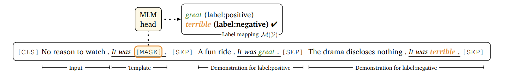
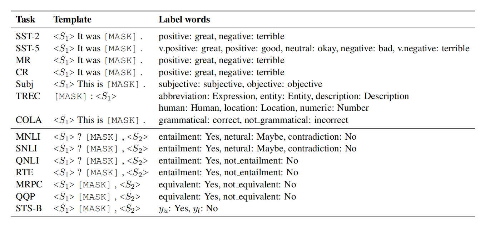
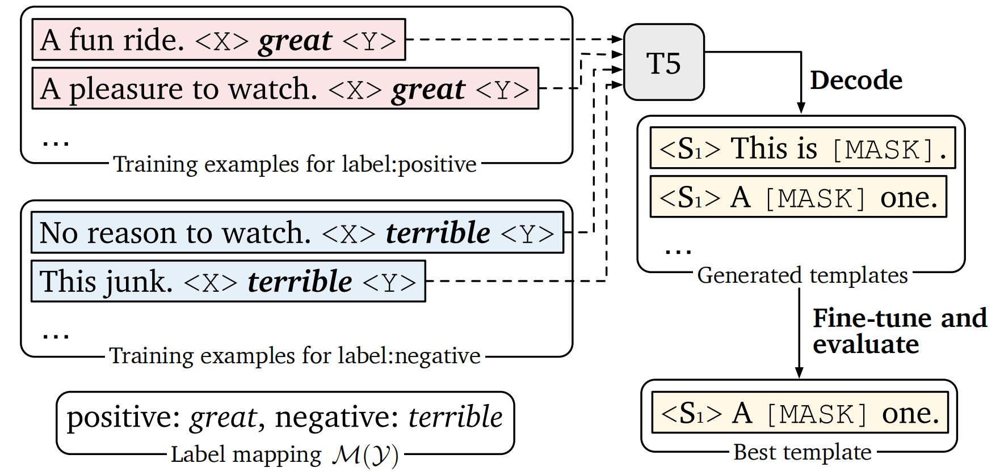
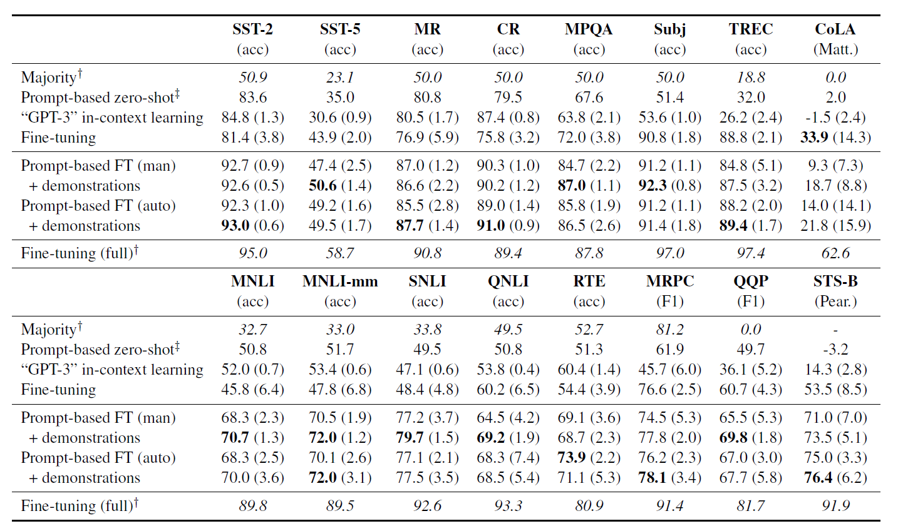
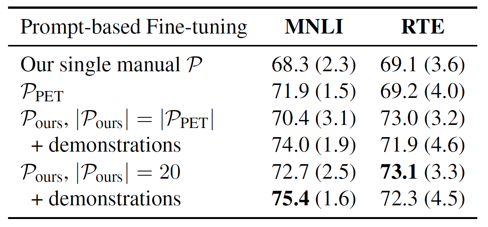
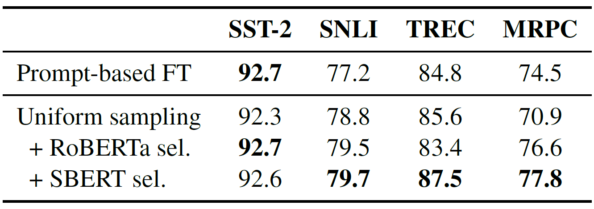
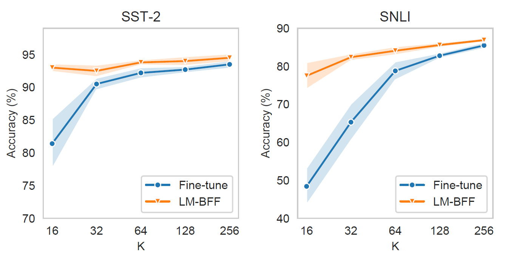

# Making Pre-trained Language Models Better Few-shot Learners

> 太长不看版
>
> 这篇论文介绍了一种名为LM-BFF的新方法，用于在有限的数据环境下微调中等规模规模的预训练语言模型。这种方法将下游任务视为带有屏蔽词的语言建模问题，模型直接对给定任务特定模板定义的提示生成文本响应（标签词）。由于直接精调的方法会引入大量的额外参数，使得从一个小样本集上学习困难重重。因此，作者采用了基于提示词的精调方法，并设计了一系列方法来自动生成提示词。
>
> 作者主要讨论了分类任务与回归任务中LM-BFF的应用。在分类任务中，使用映射$\mathcal{M}: \mathcal{Y} \rightarrow \mathcal{V}$将任务标签转换为词汇表中的单词。给定输入$x_{\text{in}}$，通过模板$\mathcal{T}$生成包含 [MASK] 的输入$x_{\text{prompt}}$。任务被视为一个语言建模问题，在有监督样本可用时，对模型$\mathcal{L}$进行微调，最小化交叉熵损失，重用预训练权重$w_v$而不引入新参数，减少了预训练与微调结果间的差距，提高了小样本集上的效果。而回归任务与分类任务相似，但将标签空间$\mathcal{Y}$视作有界区间$[v_i,u_i]$。
>
> 由于构建模板$\mathcal{T}$与标签词$\mathcal{M}(\mathcal{Y})$需要一定的专业知识与试错成本，较为困难，因此，作者提出了一种自动生成的方法。自动生成提示词的目标是减少设计提示所需要的人工参与，并找到比手动选择更优的结果。在这部分，作者给出了标签词和模板的自动生成方法。
>
> 为了自动选择标签词，作者首先在给定的模板$\mathcal{T}$下构建了一个映射$\mathcal{M}$，以在微调后，在开发集$\mathcal{D}_{\text{dev}}$上最大化准确率（开发集是与训练集大小相同的，即$|\mathcal{D}_{\text{dev}}|=|\mathcal{D}_{\text{train}}|$。然而，由于搜索空间随类别数量指数级增长并容易导致过拟合，作者采用了修剪集方法。对于每个类别$c\in\mathcal{Y}$，根据条件似然性选择前$k$个词汇形成修剪集$\mathcal{V}^c$，并在修剪后的空间中寻找最大化$\mathcal{D}_{\text{train}}$性能的前$n$个标签词分配。这些分配在微调后使用$\mathcal{D}_{\text{dev}}$重新排名以找到最佳选择。
>
> 在给定标签词下，作者使用T5模型自动生成一组多样化的模板$\left\{\mathcal{T}\right\}$。T5用于填充输入中的缺失部分，并被训练以生成与给定输入相关的模板。作者通过简单转换将输入示例转化为T5模型的输入，用于生成模板。利用束搜索，作者生成了多个模板候选项，并在$\mathcal{D}_{\text{train}}$上对每个模板进行微调，然后使用$\mathcal{D}_{\text{dev}}$选择最佳性能的模板。这一过程是自动化的，比手动调整每个数据集的提示更加高效。
>
> 之后，作者探讨了在微调型语言模型时如何更好地利用示例。作者提出了一种方法，即在每个训练步骤中都从每个类别中随机抽样一个示例，经过转换之后与$x_{\text{in}}$进行拼接。为了防止由于示例选择不当引起的错误情况，作者使用预训练的SBERT模型为所有输入句子获取嵌入表示，仅选择与$x_{\text{in}}$相似度较高的示例进行随机抽取。
>
> 实验表明，该方法相较于普通微调，取得了最高30%的绝对改进（平均11%）），但性能仍落后使用成千上万个示例进行微调的标准微调方法，同时也只能用于少量类别的分类任务中。此外，当搜索标签词时需要依赖人工设定的模板，而搜索模板时需要依赖手工设置的标签词，这会使其偏向于我们可能已经想象过的搜索空间的区域。最后，LM-BFF仅有利于某些任务，这些任务可以自然地作为“填空”问题，具有相对较短的输入序列，并且不包含许多输出类。后两个问题可能会通过较长上下文的语言模型得到改善，而对于无法利用提示词构造的任务，例如结构化预测，仍是未来需要解决的一个较大的问题。

## 摘要

最近的GPT-3模型通过仅利用自然语言提示和少量任务演示作为输入上下文，实现了显著的小样本(few-shot)性能。受到GPT-3的启发，作者在一个更实际的场景中研究了小样本学习，并使用计算效率高的较小语言模型进行微调。作者提出了LM-BFF(**B**etter **F**ew-shot **F**ine-tuning of **L**anguage **M**odel)——更好的语言模型小样本微调，这是一套用于在少量注释示例上微调语言模型的技术。作者的方法包括：

  1. 基于提示的微调，以及自动化提示生成的新型流程
  2. 一种用于动态和选择性地将示例整合到每个上下文中的精调策略。

最后，作者提出了一个系统性的评估，用于分析在一系列自然语言处理任务（包括分类和回归）上的小样本性能。实验证明，该方法在这种资源有限的环境中明显优于标准的微调程序，取得了最高30%的绝对改进，在所有任务上平均提高了11%。这种方法对任务资源和领域专业知识的假设很少，因此构成了一种强大的面向任务的小样本学习方法。

## 引言

GPT-3的小样本学习能力虽令人瞩目，但其庞大的参数量（1750亿个）限制了实际应用。为此，作者研究了基于中等规模模型（如BERT或RoBERTa）的小样本学习方法。这些模型更适合在标准硬件上训练，并且更新参数通常能提高性能。受GPT-3启发，作者研究了一个更实际的情景——假设仅能够访问中等规模的语言模型，如BERT或RoBERTa，以及少量用于微调语言模型的示例（即小样本集）。

首先，作者使用了基于提示词的预测方法。这种方法由GPT系列首次运用于零样本预测，并在最近由PET用于微调。基于提示词的预测将下游任务视为带有屏蔽词的语言建模问题，其中模型直接对给定任务特定模板定义的提示生成文本响应（称为标签词）。具体结构如下图所示。

然而，找到合适的提示词是需要领域专业知识和对语言模型内部工作原理的理解，并且由人工消耗大量时间给出的提示词可能也不够优秀。因此，作者通过引入自动提示生成来解决这个问题。自动提示生成包括修剪后的暴力搜索来识别最有效的工作标签词，以及使用T5模型自动生成模板，这些只需要少量的样本训练数据，使得我们能够廉价地获得性能相似或优于我们手动选择的有效提示。

其次，作者采用了将示例作为额外上下文的思想。不同于GPT-3，作者开发了一种更精细的策略，对于每个输入，每次从每个类别中随机抽样一个示例，以创建多个最小示例集。作者还设计了一种新颖的抽样策略，将输入与相似的示例进配对，从而为模型提供更具有区分性的比较。

作者进行了系统评估，分析了8个单句和7个句对的小样本在自然语言处理任务上的性能。与标准微调相比，取得了最高30%的绝对改进（平均11%）。作者将这种方法称为LM-BFF，这是一种有效的小样本学习方法。

## 相关工作

### 语言模型的提示词

GPT系列推动了基于提示词的学习的发展，作者遵循了许多其核心概念。作者还受到了最近PET工作的极大启发，尽管他们主要关注半监督学习。作者仅使用少量注释示例作为监督，并探讨了自动生成的提示词和使用示例进行微调。最后，有大量关于从预训练模型中挖掘知识的提示工作不同，作者专注于利用提示进行下游任务微调。

### 提示词自动搜索

Schick和Schutze¨（2021a）以及Schick等人（2020）探索了自动识别标签词的方法，然而，与手动选择的结果相比，这些方法都没有取得更好的性能。相反，作者的方法在模板和标签词上进行搜索，并能够产生性能相似或者优于手动选择的提示词。此外，作者还进行了其他几次尝试，但这些方法要么在有限的领域中运作，要么需要大量示例进行梯度引导搜索。作者的方法旨在开发仅依赖少量注释的通用搜索方法。

### 语言模型微调

近期的一些专注于改进语言模型微调的方法主要关注于优化技术和正则化技术来稳定微调过程。在这里，作者使用标准的优化技术，而主要将精力集中在更极端的小样本集中如何更好地基于提示进行微调。作者预计这些研究的结果在很大程度上是互补的。

### 小样本学习

总体而言，作者的设置也与自然语言处理中的其他小样本学习范式相关，包括：半监督学习(semi-supervised learning)、元学习(meta-learning)和中间训练(intermediate training)等。作者通过对可用资源进行最小化的假设偏离了这些任务，即只假设有少量的注释示例和一个预训练的语言模型，重点是了解在没有其他优势的情况下能推动到多远。

## 问题设置

### 任务制定

在这项任务中，假设可以访问一个预训练的语言模型$\mathcal{L}$，希望在任务$\mathcal{D}$上进行微调，该任务具有标签空间$\mathcal{Y}$。对于任务，假设每个类别有$K$个训练示例（为了进行回归，将数据划分为两个 "类别"，按照高于或低于中位值来划分），形成了任务的训练集$\mathcal{D}_{\text{train}}$，使得示例的总数为$K_{\text{tot}}=K\times|\mathcal{Y}|$，并且$\mathcal{D}_{\text{train}}=\left\{(x^i_{\text{in}},y^i)\right\}^{K_{\text{tot}}}_{i=1}$。那么，整体的目标就是开发任务无关的学习策略，以在未知的的测试集$(x^{\text{test}}_{\text{in}},y^{\text{test}})\thicksim\mathcal{D}_{\text{test}}$上良好泛化。

对于模型选择和超参数调整，则使用一个与小样本训练集相同大小的开发集$\mathcal{D}_{\text{dev}}$，即$|\mathcal{D}_{\text{dev}}|=|\mathcal{D}_{\text{train}}|$。这种区分很重要，因为使用更大的开发集会带来显著的优势，违反了我们从有限数据中学习的初衷。在后续的实验中，若无特殊说明，则取$\mathcal{L}=\text{RoBERTa-large}$，$K=16$。

### 评估集

作者在8个单句和7个句对英语任务上进行了系统研究，包括GLUE基准测试的8个任务，SNLI和其他6个流行的句子分类任务（SST-5，MR，CR，MPQA，Subj，TREC）（详见原文附录B）。对于单句任务，目标是根据输入句子$x_{\text{in}}=x_1$进行预测，例如一部电影评论是积极的还是消极的。对于句对任务，目标是取一对输入句子$x_{\text{in}}=(x_1,x_2)$并预测它们之间的关系。作者主要使用SST-2和SNLI进行试验和模型开发，使其接近真正的小样本集。

### 评估方法

系统评估小样本性能可能会很棘手。因为对小型数据集进行微调可能会受到不稳定性的影响，并且结果可能在给定新数据拆分的情况下发生显著变化。为了解决这个问题，作者在5个不同的随机抽样的$\mathcal{D}_{\text{train}}$和$\mathcal{D}_{\text{dev}}$上测量平均性能。在之前的研究中，有的研究者建议使用一组固定的训练示例。但是，作者认为，采样多个拆分可以更稳健地衡量性能，并更好地估计方差。作者还观察到超参数可能产生重大差异，因此作者为每个数据样本扫描多个超参数，并将在该样本的$\mathcal{D}_{\text{dev}}$上测量的最佳设置作为最佳设置（详见原文附录C.1）。

## 基于提示词的精调

在给定一个掩码语言模型(MLM)$\mathcal{L}$的情况下，首先将$x_{\text{in}}$转换为一个token序列$\widetilde{x}$，然后语言模型$\mathcal{L}$将$\widetilde{x}$映射到一系列隐藏向量$\left\{\mathbf{h}_k\in\mathbb{R}^d\right\}$。在标准微调中，通常取$\widetilde{x}=[\text{CLS}]x_1[\text{SEP}]$或$\widetilde{x}_{\text{pair}}=[\text{CLS}]x_1[\text{SEP}]x_2[\text{SEP}]$。对于具有标签空间$\mathcal{Y}$的下游分类任务，我们通过最大化正确标签的对数概率来训练一个任务特定的头部，即$\text{softmax}(\mathbf{W}_0,\mathbf{h}_{[\text{CLS}]})$，其中，$\mathbf{h}_{[\text{CLS}]}$是$[\text{CLS}]$对应的隐藏向量，而$\mathbf{W}_0\in\mathbb{R}^{|\mathcal{Y}|\times d}$是在微调开始时引入的一组随机初始化的参数。类似地，对于回归任务，可以引入$\mathbf{w}_0\in\mathbb{R}^{d}$，并优化$\mathbf{w}_0\cdot h_{[\text{CLS}]}$与黄金标签(gold label)之间的方差。在任何情况下，新参数的数量可能是相当大的——例如，对于RoBERTa-large模型的一个简单的二元分类任务，将引入2,048个新参数，这使得从少量注释数据（例如，32个示例）中学习变得具有挑战性。

解决这个问题的另一种方法是基于提示的微调，其中$\mathcal{L}$直接被要求“自动完成”自然语言提示。例如，我们可以使用具有输入$x_1$的提示（例如，“No reason to watch it .”）来制定一个二元情感分类任务，那么，$x_{\text{prompt}}=[\text{CLS}] \ x_1 \ \text{It} \ \text{was} \ [\text{MASK}]. \ [\text{SEP}]$，并让$\mathcal{L}$决定在[MASK]中填入“great”（积极）还是“terrible”（消极）。

### 分类任务

设$\mathcal{M}: \mathcal{Y} \rightarrow \mathcal{V}$是从任务标签空间到词汇表中单个单词的映射（这个映射可以是一对多的，即对应多个单词，然而，在实验中，作者并没有发现显著的收益）。然后，对于每个$x_{\text{in}}$，令$x_{\text{prompt}}=\mathcal{T}(x_{\text{in}})$是一个包含一个 [MASK] 标记的掩码语言模型 （MLM） 输入。这样，我们可以将我们的任务视为一个带有屏蔽词的语言建模问题，并将预测结果$y\in\mathcal{Y}$的概率定义为：

\begin{align*}
p(y|x_{\text{in}})&=p([\text{MASK}]=\mathcal{M}(y)|x_{\text{prompt}}) \\
 &=\frac{\text{exp}(\mathbf{w}_{\mathcal{M}(y)}\cdot\mathbf{h}_{[\text{MASK}]}))}{\Sigma_{y'\in\mathcal{Y}}(\mathbf{w}_{\mathcal{M}(y')}\cdot\mathbf{h}_{[\text{MASK}]})}
\end{align*}

其中，$h_{[\text{MASK}]}$是[MASK]所对应的隐藏向量，$w_v$代表$v\in\mathcal{V}$所对应的softmax前向量。当监督样本$\left\{(x_{\text{in}},y)\right\}$可用时，可以对$\mathcal{L}$进行微调，以最小化交叉熵损失。需要注意的是，这种方法重用了预训练的权重$w_v$，并且没有引入任何新参数。它还减少了预训练和微调结果之间的差距，使其在小样本集上更有效。

### 回归任务

回归任务与分类任务相似，但将标签空间$\mathcal{Y}$视作有界区间$[v_i,u_i]$。受到之前研究的启发，作者将问题建模为两个相对极点$\left\{y_i,u_i\right\}$之间的插值，值分别记作$v_l$与$v_u$。例如，之前的情感分析任务可以被表述为$[0,1]$范围内的回归问题，在“糟糕”（$v_l=0$）和“很棒”（$v_u=1$）之间滑动。通过这种方式，我们可以将$y$表示为混合模型，即：$y=v_l \cdot p(y_l|x_{\text{in}})+v_u \cdot p(y_u|x_{\text{in}})$，其中，$p(y_u|x_{\text{in}})$表示输入$x_{\text{in}}$的预测结果为$y_u$的概率，$p(y_l|x_{\text{in}})=1-p(y_u|x_{\text{in}})$。之后，我们定义$\mathcal{M}:\left\{y_l,y_u\right\}\rightarrow\mathcal{V}$，$p(y_u|x_{\text{in}})$的具体表达形式与之前分类任务中的$p(y|x_{\text{in}})$相同。之后，就可以通过最小化推断出的$p(y_u|x_{\text{in}})$与混合模型的权重$\frac{y-v_l}{v_u-v_l}$之间的KL散度来微调模型$\mathcal{L}$。

### 手动提示词：好提示词与差提示词

最具有挑战性的部分是构建模板$\mathcal{T}$与标签词$\mathcal{M}(\mathcal{Y})$，这两者被统称为提示词$\mathcal{P}$。之前的研究中使用的是人工标注的模式，这就需要一定的专业知识与试错成本。

为了更好地理解什么是好的模板或标签词，作者对SST-2和SNLI进行了试点研究。结果显示，不同的提示会导致最终准确性差异极大。具体来说，当模板固定时，标签词与“语义类”的匹配度越高，最终的准确性就越好。在极端情况下，作者尝试交换看似合理的标签词，发现整体性能表现最差。此外，对于同一组标签词，即使模板中有一些微小的更改，最终结果也会产生差异。下图展示了作者在实验中人工选择的标签词和模板。

选择好的模板和标签词是极其重要的，但是，搜索提示词很困难，因为搜索空间可能非常大，尤其是对于模板而言。此外，仅仅只有几个示例能够用于指导搜索，这将极其容易导致过拟合。下面一节将详细讲述如何解决这些问题。

## 提示词自动生成

自动生成提示词的目标是减少设计提示所需要的人工参与，并找到比手动选择更优的结果。在这部分，将以分类任务为基础展开探讨，回归的过程与其是类似的。

### 标签词自动选择

作者首先研究了在给定一个固定模板$\mathcal{T}$的情况下，在微调后，在$\mathcal{D}_{\text{dev}}$上构建一个标签词映射$\mathcal{M}$，使其准确率最大。然而，自然的搜索过程中，搜索空间随类别数量的增加指数级增长，并且容易导致过拟合。因此，对于每个类别$c\in\mathcal{Y}$，使用初始的$\mathcal{L}$根据前$k$个词汇的条件似然性构成一个修建集$\mathcal{V}^c\subset\mathcal{V}$。也就是说，令$\mathcal{D}^c_{\text{train}}\subset\mathcal{D}_{\text{train}}$为结果为c的所有示例的集合。那么，可取$\mathcal{V}^c$为：
$$
\mathop{\text{Top-k}}\limits_{v\in\mathcal{V}}\left\{\sum_{x_{\text{in}}\in\mathcal{D}^c_{\text{train}}}\text{log}P_{\mathcal{L}}([\text{MASK}=v|\mathcal{T}(x_{\text{in}}))\right\}
$$

其中，$P_{\mathcal{L}}$表示$\mathcal{L}$的输出概率分布。即，选取在给定输入序列$x_{\text{in}}$和模板$\mathcal{T}$时，出现在[MASK]位置概率最高的$k$个词汇作为标签词。为了进一步缩小搜索空间，作者在修剪后的空间上找到了前$n$个标签词分配，这些标签词分配最大限度地提高了$\mathcal{D}_{\text{train}}$的zero-shot性能（其中，$n$和$k$都是超参数，详细信息参见原文附录C.2）。之后，作者将微调所有的前$n$个标签词分配，并使用$\mathcal{D}_{\text{dev}}$重新排名，以找到最佳标签词分配。这种方法与Schick和Schütze（2021a）以及Schick等人（2020）在自动语义化搜索方法中的类似，不同之处在于此处使用了一个更简单的搜索过程（暴力法）并且应用了重新排名，结果显示这这非常有帮助。

### 模板自动生成

接下来，作者研究了如何从固定的标签词集合$\mathcal{M}(\mathcal{Y})$自动生成一组多样化的模板$\left\{\mathcal{T}\right\}$。为了解决这个具有挑战性的问题，作者使用了T5（Raffel et al., 2020），一个大型的预训练文本到文本的Transformer模型。T5被预训练用于填充输入中的缺失部分（由T5的掩码标记替换，例如，`<X>`或`<Y>`）。例如，给定输入“Thank you `<X>` me to your party `<Y>` week”，T5被训练为生成“`<X>` for inviting `<Y>` last `<Z>`”，这意味着“for inviting”是<X>的替代部分，“last”是<Y>的替代部分。这非常适用于提示生成，我们可以简单地从$\mathcal{D}_{\text{train}}$中取输入句子，使用T5模型构建模板T，而无需为其指定预定义的标记数量。

对于给定的输入示例$(x_{\text{train}},y)\in\mathcal{D}_{\text{train}}$，可以考虑以下简单的转换，表示为$\mathcal{T}_g(x_{\text{in}},y)$，用于制定T5模型的输入：

$$
\begin{align*}
<S1>&\rightarrow<X>\mathcal{M}(y)<Y><S1>, \\
<S1>&\rightarrow<S1><X>\mathcal{M}(y)<Y>, \\
<S1>,<S2>&\rightarrow<S1><X>\mathcal{M}(y)<Y><S2>
\end{align*}
$$

如下图所示，可以通过T5模型来填充占位符，生成对应的模板。

在解码时，目标是找到一个适用于$\mathcal{D}_{\text{train}}$中所有示例的输出，即使得$\sum^{|\mathcal{T}|}_{j=1}\sum_{(x_{\text{in}},y)\in\mathcal{D}_{\text{train}}}\text{log}P_{\text{T5}}(t_j|t_1,\cdots,t_{j-1},\mathcal{T}_g(x_{\text{in}},y))$最大的模板$\mathcal{T}$。其中，$P_{\text{T5}}$表示T5的输出概率分布，而$(t_1,\cdots,t_{|\mathcal{T}|})$代表模板的token。

之后，作者使用束搜索（beam search）来解码多个模板候选项。具体来说，就是使用宽波束宽度（例如，100）来廉价地获得大量多样化的模板。然后，我们对每个生成的模板在$\mathcal{D}_{\text{train}}$上进行微调，并使用$\mathcal{D}_{\text{dev}}$来选择具有最佳性能的单个模板，或者选择使用作为集成的前k个模板。

尽管在每个单独的模板上进行微调可能看起来很昂贵，但实际上由于$\mathcal{D}_{\text{train}}$的规模较小，因此实践中很快，并且是完全自动化的。与手动调整每个数据集的提示相比，这使得使用变得更加容易。

## 使用示例进行微调

在本节，作者主要研究了否可以在微调中型语言模型时利用示例，并试图找到更好利用它们地方法。

### 作为训练数据的示例

GPT-3在上下文学习中的方法只是将输入与从训练集中随机选择的32个示例串联起来。这种方法是次优的，因为可用示范的数量受到模型最大输入长度的限制，并且将来自不同类别的大量随机示例混合在一起会创建非常长的上下文，这可能是难以利用的，尤其是对小模型来说。

为了解决这些问题，作者提出了一个更简单的解决方案，即在每个训练步骤中，从每个类别中随机抽样一个示例$(x_{\text{in}}^{(c)},y^{(c)})\in\mathcal{D}_{\text{train}}$，然后将它转换为$\mathcal{T}(x_{\text{in}}^{(c)})$，其中[MASK]被$\mathcal{M}(y^{(c)})$代替。不妨将其记为$\widetilde{\mathcal{T}}(x_{\text{in}}^{(c)},y^{(c)})$，之后，将其与$x_{\text{in}}$拼接，即:

$$
T(x_{\text{in}})\oplus\widetilde{\mathcal{T}}(x_{\text{in}}^{(1)},y^{(1)})\oplus(x_{\text{in}}^{(2)},y^{(2)})\oplus\cdots\oplus(x_{\text{in}}^{(|\mathcal{Y}|)},y^{(|\mathcal{Y}|)})
$$

其中，$\oplus$表示序列的连接。结构如下图所示：

在训练和推断过程中，为每个$x_{\text{in}}$抽取多个示例集。需要注意的是，在训练过程中，$x_{\text{in}}$和示例都是从$\mathcal{D}_{\text{train}}$中抽取的；在测试时，仍然从$\mathcal{D}_{\text{train}}$中抽样，并在所有集合中进行预测的集成。

### 抽样相似示例

观察到，示例$(x_{\text{in}}^{(c)},y^{(c)})$的构建对于最终性能非常重要。例如，如果对比示例集$x_{\text{in}}^{(c)}$的示例都彼此截然不同，或者与$x_{\text{in}}$非常不同，那么语言模型将难以理解其意义。因此，模型可能会简单地忽略上下文，甚至会被额外的示例所迷惑。为了解决这个问题，作者设计了一个简单的策略，即只抽样与$x_{\text{in}}$在语义上接近的示例。具体来说，作者使用使用预训练的SBERT模型为所有输入句子获取嵌入表示（对于句对任务，使用两个句子的连接形式）。在这里，只将原始句子输入SBERT，不包括模板。对于每个$x_{\text{in}}$和每个标签$c\in\mathcal{Y}$，可以根据它们与$x_{\text{in}}$的相似性$cos(e(x_{\text{in}}),e(x))$对具有标签$x\in\mathcal{D}^c_{\text{train}}$的所有训练实例进行排序，然后只从每个类别中的前$r=50%$的实例中抽样来用作示例。

## 实验

### 主要结果

在实验中，作者采用了$\mathcal{L}=\text{RoBERTa-large}$，并设定$K=16$。

对于自动提示搜索，该方法表现出色，结果如下。其中，T表示自动生成模板，L表示自动生成标签词。

下图展现了一些对比的结果。其中，$\dagger$表示使用全部训练集进行训练，$\ddagger$表示没有使用训练示例；FT代表微调，man表示手动提示，auto表示自动生成提示。此外，CoLA是一个例外，因为输入可能是一个不符合语法的句子，因此导致该方法效果较差。

自动提示搜索的一个优势是可以生成任意多的提示，训练单独的模型，并创建大型集成。PET也集成了使用手动提示训练的多个模型。下图展示了当前方法搜索的提示和PET的手动提示在MNLI和RTE上的比较结果。结果显示，使用多个模板的集成提高了性能，使用同样数量的自动模板的集成实现了与PET手动提示的集成相当或更好的性能，并且增加自动模板的数量带来了进一步的提升。

下图展示了随机抽取示例和使用SBERT进行选择性抽取的结果对比。同时，作者发现，在任何情况下，使用选择性抽样都优于随机抽样，突显了在上下文中引入示例时抽样相似示例的重要性。

此外，于像SST-2这样的简单任务，尽管只使用了总共32个示例，LM-BFF已经几乎饱和了性能，并且在整个数据集上与标准微调相媲美。在更难的任务中，随着$K$的增加，LM-BFF的性能仍在提高，同时保持与标准微调的性能差距，直到在K=256附近收敛。如下图所示。

## 讨论

将NLP任务改编为MLM任务对小样本学习具有一定的积极意义，但也存在局限性。首先，尽管LM-BFF大大优于标准微调，但总体上，其性能仍然远远落后于使用成千上万例子进行微调的结果，特别是对于更难的任务。此外，与标准微调一样，这种方法结果也存在高方差。关于自动提示生成，尽管有效在实际应用中扩大搜索空间或仅基于大约32个示例进行良好泛化仍然具有挑战性。这种方法在较低的K值下，一致性地优于标准微调，这部分归因于对一些手动设计的依赖，即手动模板（用于标签词搜索）和手动标签词（用于模板搜索），这使我们能够开始搜索，但也使搜索倾向于我们可能已经想象过的搜索空间领域。最后，需要明确的是，LM-BFF更适用于那些可以自然地构建为“填空”问题、输入序列相对较短且输出类别不多的任务。对于难以用提示形式表达的任务，如结构化预测，这是一个更根本的问题。将这作为未来工作的一个开放性问题。

## 结论

本文介绍了LM-BFF，一套使用极少数示例微调语言模型的简单但有效技术。这种方法包括使用自动搜索的提示进行基于提示的微调，以及将选定的任务演示（训练示例）作为输入上下文的一部分。同时，作者证明了该的方法比普通微调提高了最高30%（平均提高了11%）。最后，作者讨论了这种方法的局限性，并提出了未来研究的开放性问题。
