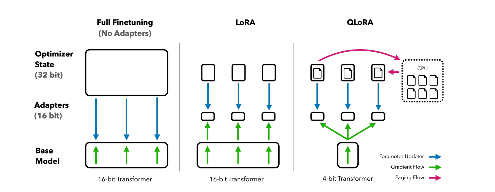
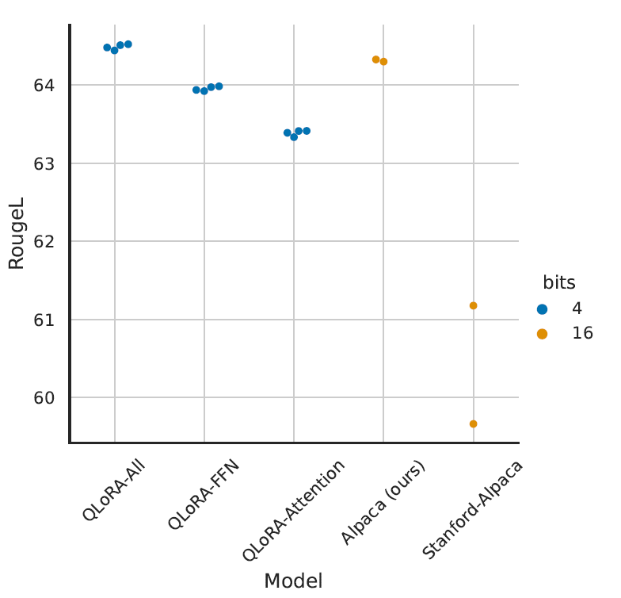
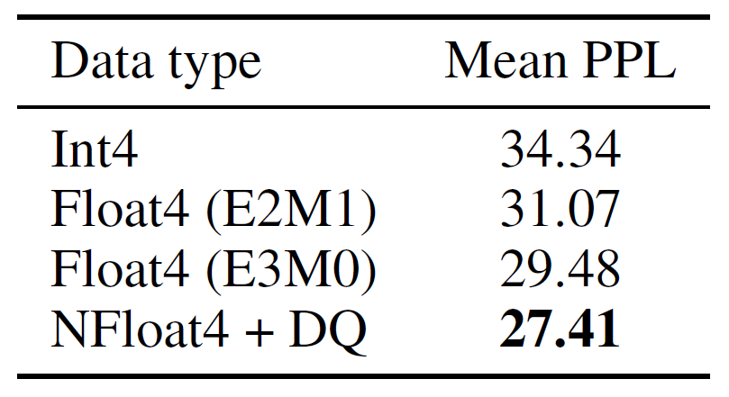
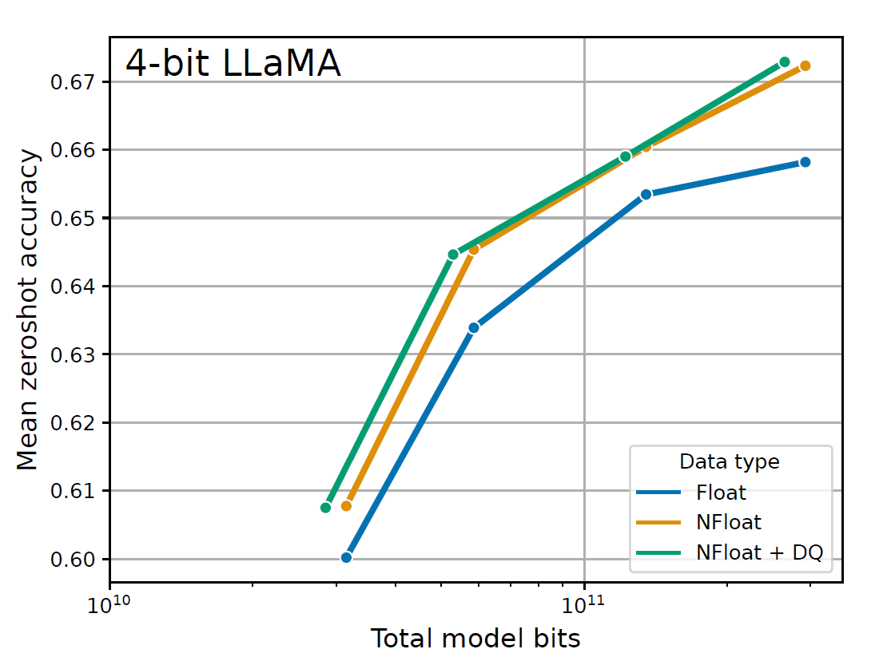
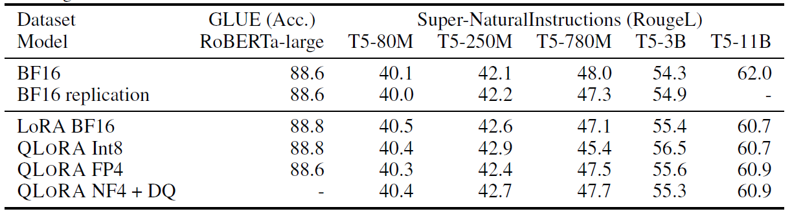
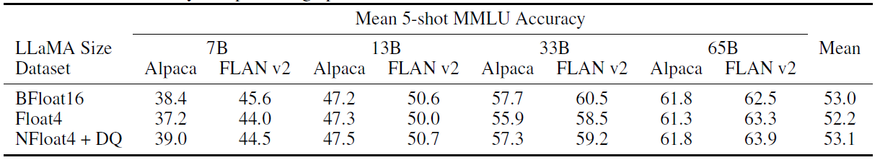
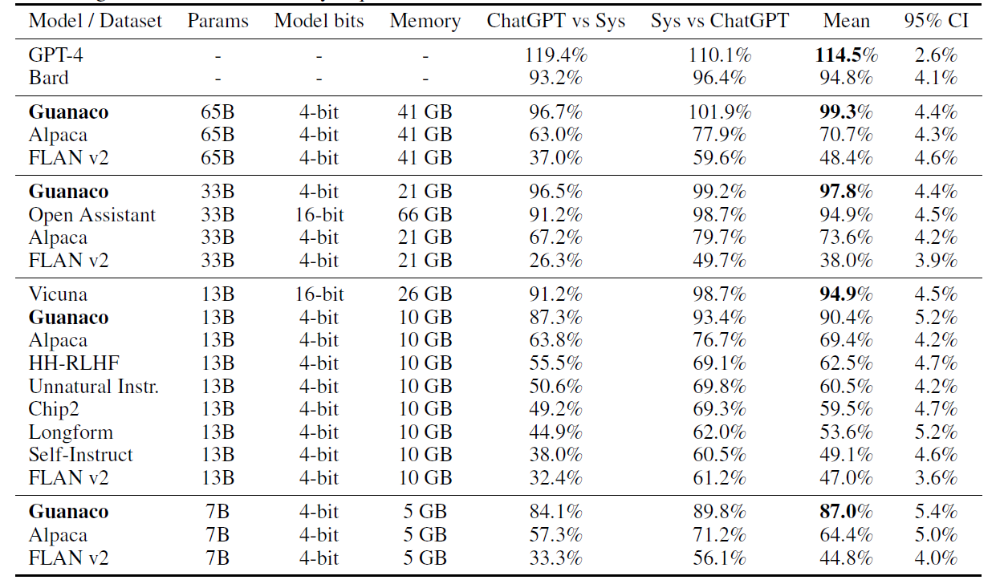
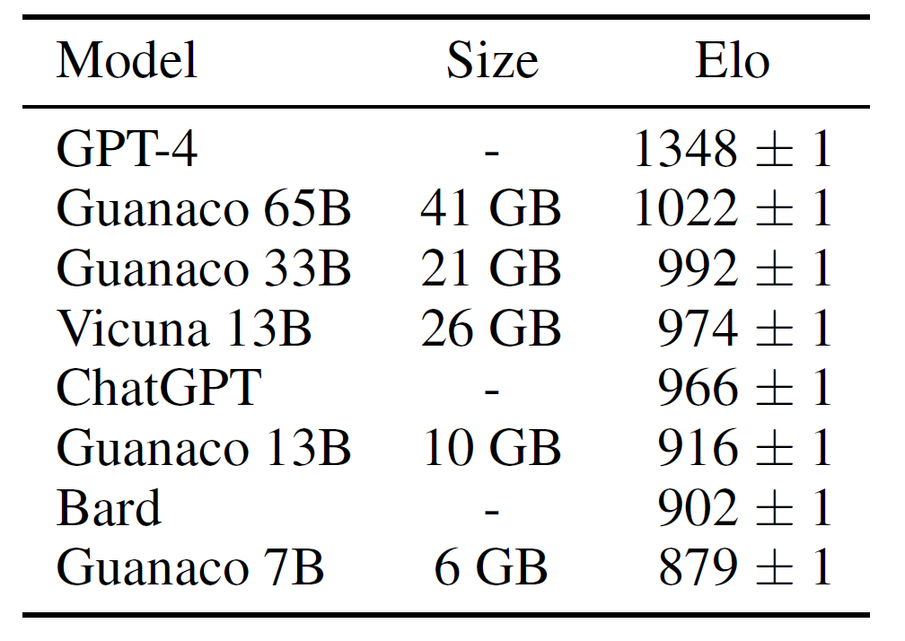
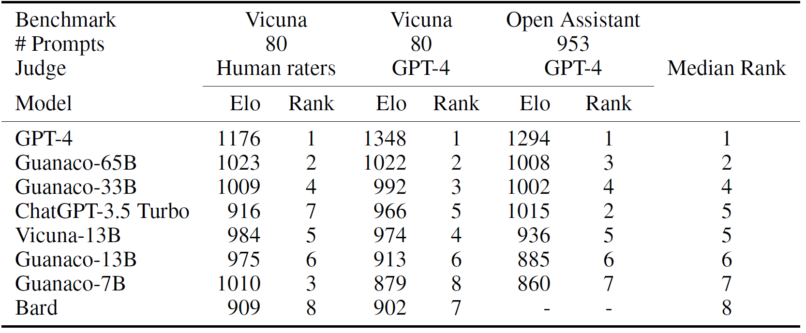

# QLoRA:Efficient Finetuning of Quantized LLMs

> 太长不看版
>
> 文章主要介绍了一种名为QLoRA的高效微调方法，同时提供了聊天机器人性能的详细分析。QLoRA提出了一种新的数据类型，称为4位NormalFloat(NF4)，同时使用双重量化和分页优化器，实现了在不损失性能（33B和65B规模的模型未经实验证实）的前提下减小微调对显存的占用。
>
> NF4是建立在分位数量化基础上的一种数据类型，是一种信息论上最优的数据类型。在神经网络中，预训练的权重通常具有零中心的正态分布，进行分位数量化可以避免昂贵的分位数估计和近似误差。假设需要$k$位数据，那么对于这样的正态分布，首先估计一个标准正态分布$N(0, 1)$的分位数（需要计算$2k+1$个分位数），通过缩放将其归一化至$[-1, 1]$之间，之后对其进行量化，生成对应的NF4类型数据。为了精确表示零，作者也提出了创建一个非对称数据类型的方法，即分别计算正、负的分位数，之后去除重复的零。
>
> 双重量化旨在进一步减小对显存的需求。双重量化，即先对原始输入数据进行量化，再对量化常数进行量化。例如，假设使用32位的常数来量化参数，块大小为64，那么每个参数就需要额外的$\frac{32}{64}=0.5$位来存储参数。假设第二次量化的块大小为256，使用另一个32位常数进行量化，将第一次量化所使用的32位常数进行再一次量化，量化为8位的数据，此时，每个参数需要的额外空间就缩小为$\frac{8}{64}+\frac{32}{64\times 256}=0.127$位，缩小了0.373位。
>
> 分页优化器实现的是GPU偶尔显存不足的情况下实现CPU和GPU之间的自动页对页传输，以确保GPU处理没有错误。即当GPU显存不足时，将部分参数“驱逐”到CPU RAM，并在优化器更新步骤需要时重新分页到GPU显存。
>
> 实验结果一致表明，使用NF4数据类型的4位QLoRA可以在学术基准测试中与16位完全微调和16位LoRA微调性能相匹配，并证明了NF4类型要优于FP4类型，双重量化不会降低性能。
>
> 通过GPT-4评估和人工评估，作者发现了顶级的QLoRA调优模型Guanaco 65B，它是在OASST1变种上微调的。与 GPT-4 相比，Guanaco 65B和33B在系统级别的人工评估Elo评分比较中，具有30%的预期胜率，这是迄今为止报道的最高水平。

## 摘要

这篇文章介绍了一种名为QLoRA的高效微调方法，能够在保证微调性能的同时，降低对显存的需求（能够在单个48G显存的GPU上，在保持完整的16位微调性能的情况下，微调一个具有65B参数的模型）。QLoRA将梯度通过一个冻结的4位量化预训练语言模型反向传播到低秩适配器（LoRA）。作者提出的最佳模型系列称为Guanaco，在Vicuna基准测试中表现优异，仅需在单个GPU上进行24小时的微调即可达到ChatGPT性能的99.3%。QLoRA引入了一些节省显存的创新技术，如引入了4位NormalFloat（NF4）数据类型、双重量化以减少显存占用，并使用分页优化器来管理显存使用。作者使用QLoRA微调了1000多个模型，对8个指令数据集、多个模型类型和大规模模型进行了详细分析。研究结果表明，在小规模高质量数据集上使用QLoRA微调可以获得最新的性能结果，即使使用比以前的最新技术小的模型也是如此。此外，作者还提供了聊天机器人性能的详细分析，包括人类评估和GPT-4评估（作者认为，结果也表明使用GPT-4进行评估是一种廉价而合理的代替人工评估的方法），以及对聊天机器人基准测试的批评。作者还公开发布了所有的代码，包括用于4位训练的CUDA核心（[QLoRA](https://github.com/artidoro/QLoRA)和[bitsandbytes](https://github.com/TimDettmers/bitsandbytes)）。

## 引言

对大语言模型（LLM）进行微调是提高它们性能的一种方法，微调也可以为LLM添加所需的行为或去除不需要的行为。然而，微调非常大的模型成本过高；对LLaMA 65B参数模型进行常规的16位微调需要超过780GB的GPU显存。尽管一些量化方法可以降低LLM对显存的需求，但是这些方法只能在推断过程中使用，而无法直接应用于训练阶段。

作者首次展示了在不降低性能的情况下微调4位量化模型的可能性。QLoRA使用一种新颖的高精度技术将预训练模型量化为4位，然后通过反向传播梯度来调整一小组可学习的低秩适配器权重，再这些权重附加到量化权重上。

QLoRA能够将微调65B参数模型的平均显存需求从超过780GB的GPU显存降低到不到48GB，而不会降低其性能，从而使得可以在单个GPU上微调最大的公开可用模型。使用QLoRA，他们训练了Guanaco系列模型，其中最好的模型在Vicuna基准测试上达到了ChatGPT性能水平的97.8%。

QLoRA引入了多项创新来减少显存使用，包括4位NormalFloat、双重量化和分页优化器等。这些方法使得LoRA可以更好地调整，包括在每个网络层都包含适配器，几乎避免了以前工作中看到的所有准确性权衡。

得益于QLoRA的高效性，作者进行了进一步的深入研究，包括指令微调、聊天机器人性能的研究和在80M到65B参数之间的多种规模的模型的训练。此外，作者还提供了聊天机器人性能的广泛分析，包括人工评分和GPT-4评估。最后，作者还通过定性分析Guanaco模型，增强了聊天机器人基准结果。

## 背景

### 分块k位量化（Block-wise k-bit Quantization）

量化是将具有更多信息的输入从一种表示形式转化为具有更少信息的表示形式的过程。通常，它意味着将具有更多位的数据类型转换为更少位，例如从32位浮点数转换为8位整数。为确保低位数据类型的整个范围得到利用，通常通过输入元素的最大绝对值，将输入数据类型归一化到目标数据类型范围来重新缩放，这些元素通常以张量的形式结构化。例如，将一个32位浮点数（FP32）张量量化为范围为$[−127, 127]$的Int8张量，使用$c$表示其量化常数（或称量化比例），那么量化过程为：

$$
X^{\text{Int8}}=\text{round}（\frac{127}{\text{absmax}（X^{\text{FP32}}）}X^{\text{FP32}}）=round（c^{\text{FP32}}\cdot X^{\text{FP32}}）
$$

相反的，反量化过程为：

$$
\text{dequant}（c^{\text{FP32}},X^{\text{Int8}}）=\frac{X^{\text{Int8}}}{c^{\text{FP32}}}=X^{\text{FP32}}
$$

这种方法的问题在于，如果输入张量中出现异常值，那么$c$的选取将会受到很大的影响，这也将会导致某些区间中将几乎没有或没有数值量化。为了防止异常值问题，常见的方法是将输入张量分块，然后独立量化每个块，使得每个块都有自己的量化常数$c$。即：将输入张量$X\in\mathbb{R}^{b\times h}$展平，分为连续的$n$个大小为$B$的块（$n=（b\times h）/B$），之后使用上述公式独立量化这些块，创建一个量化张量和$n$个量化常数$c$。

### 低秩适配器

低秩适配器（LoRA）微调通过使用一小组可训练参数，同时冻结原LLM参数，来减少训练中显存的占用。在随机梯度下降期间，梯度通过固定的预训练模型权重传递到适配器，适配器随后更新以优化损失函数。LoRA通过一个额外的因子化投影来增强线性投影，即，给定一个投影$\mathbf{XW}=\mathbf{Y}$，其中，$\mathbf{X}\in\mathbb{R}^{b\times h}$，$\mathbf{W}\in\mathbb{R}^{h\times o}$，那么：

$$
\mathbf{Y}=\mathbf{XW}+s\mathbf{X}\mathbf{L}_1\mathbf{L}_2
$$

其中，$\mathbf{L}_1\in\mathbb{R}^{h\times r}$，$\mathbf{L}_2\in\mathbb{R}^{r\times o}$，$s$表示一个标量。

### 参数高效微调的显存需求

在参数高效微调方法（PEFT）中，显存的大部分占用来源于激活梯度，而不是来自学习的LoRA参数。例如，对于一个在FLAN v2上以批量大小1训练的7B LLaMA模型，其LoRA权重相当于原始模型权重的0.2%，LoRA输入梯度的显存占用为567 MB，而LoRA参数仅占用26 MB。即使使用梯度检查点技术可以将输入梯度的平均显存减少到每序列 18 MB，但它们仍然比所有 LoRA 权重的总和还要占用更多显存。相比之下，4-bit基础模型消耗了5,048 MB的显存。这显示了梯度检查点技术的重要性，同时也表明，大幅度减少 LoRA 参数数量只能带来较小的显存节省。这意味着我们可以使用更多的适配器，而不会显著增加整体训练显存占用，这对于恢复完整的 16 位精度性能至关重要。

## QLoRA微调

QLoRA通过4位NormalFloat（NF4）量化和双重量化实现了高保真的4位微调，同时引入了分页优化器，防止梯度检查点期间的显存峰值超出单台计算机的上限。

QLoRA具有一个低精度存储数据类型，通常为4位，以及一个通常为BFloat16的计算数据类型。每当使用QLoRA权重张量时，就需要将张量反量化为BFloat16，然后进行16位矩阵乘法运算。

### 4位NormalFloat（NF4）量化

4位NormalFloat量化是一种构建在分位数量化基础上的数据类型，它是一种信息理论上最优的数据类型，确保每个量化区间从输入张量中分配的值数量相等。分位数量化通过估计输入张量的分位数来工作，分位数的估计是通过经验累积分布函数完成的。

分位数量化的主要局限性在于分位数估计过程非常昂贵。因此，通常使用快速分位数近似算法（例如SRAM分位数）来估计它们。由于这些分位数估计算法是近似的，所以对于异常值存在较大的量化误差。

当输入张量是一个在量化常数范围内固定的分布时，可以避免昂贵的分位数估计和近似误差。在这种情况下，输入张量具有相同的分位数，使得精确的分位数估计在计算上是可行的。

由于预训练的神经网络权重通常具有零均值正态分布，设其标准差为$\sigma$，那么，我们可以通过缩放$\sigma$来使分布完全适合到我们的数据类型范围内，将所有权重转化为一个单一的固定分布。对于这种数据类型，作者设置范围为$[-1, 1]$，因此，数据类型的分位数和神经网络权重都需要归一化到这个范围内。

对于均值为零且标准差$\sigma$在范围$[-1, 1]$内的零均值正态分布，信息理论上最优的数据类型计算方法如下：

  1. 估计一个标准正态分布（记作$N(0,1)$）的分位数。如果数据有$k$位，那么需要计算$2k+1$个分位数；
  2. 标准化数据类型。将计算得到的分位数值标准化到$[-1, 1]$的范围内；
  3. 量化输入权重。通过最大绝对值重新缩放，将输入权重张量标准化到$[-1, 1]$进行量化，即使用之前计算并标准化的分位数，将这些权重映射到离散的量化值上。

一旦权重范围和数据类型范围匹配，那么就可以就可以进行普通的量化。上述的步骤3等效于重新缩放权重张量的标准差以匹配$k$位数据类型的标准差。若$Q_X(\cdot)$是标准正态分布$N(0, 1)$的分位数函数，那么$2k$个$q_i$可以用如下式子表示：

$$
q_i=\frac{1}{2}(Q_X(\frac{i}{2^k+1})+Q_X(\frac{i+1}{2^k+1}))
$$

在对称$k$位量化中，存在一个问题，即它无法精确地表示零，但是在很多情况下（例如对填充值或其他零值元素进行量化时），需要能够无误差地表示零。为了确保可以有一个离散的零点（即精确表示零的能力），并且充分利用所有的$2^k$位来表示一个$k$位的数据类型，作者提出了创建一个非对称数据类型的方法。

这个非对称数据类型是通过估计两个范围的分位数$q_i$来创建的，即一半（$2^{k-1}$）的$q_i$用于表示负数部分，另一部分（$2^{k-1}+1$）的$q_i$用于表示正数部分。然后，这些分位数集合被合并，并去除两个集合中都出现的零之一，从而确保零点的唯一性。由此产生的数据类型被称为 k 位NormalFloat（NFk），因为它在信息论上对于以零为中心的正态分布数据是最优的（这个数据类型的具体值详见原文附录E）。

此部分[代码](https://github.com/TimDettmers/bitsandbytes/blob/main/bitsandbytes/functional.py)如下：

``` Python
def create_normal_map(offset=0.9677083, use_extra_value=True):
    from scipy.stats import norm  # 用于处理正态分布

    if use_extra_value:
        # one more positive value, this is an asymmetric type
        v1 = norm.ppf(torch.linspace(offset, 0.5, 9)[:-1]).tolist() # 正数部分分位数
        v2 = [0]*(256-15) ## we have 15 non-zero values in this data type
        v3 = (-norm.ppf(torch.linspace(offset, 0.5, 8)[:-1])).tolist() # 负数部分分位数
    else:
        v1 = norm.ppf(torch.linspace(offset, 0.5, 8)[:-1]).tolist()
        v2 = [0]*(256-14) ## we have 14 non-zero values in this data type
        v3 = (-norm.ppf(torch.linspace(offset, 0.5, 8)[:-1])).tolist()

    v = v1 + v2 + v3

    values = torch.Tensor(v)
    values = values.sort().values
    values /= values.max() # 归一化

    assert values.numel() == 256 # 确保元素数量正好为256

    return values
```

### 双重量化

双重量化是对量化常数进行额外的显存节省过程。虽然精确的4位量化需要较小的块大小，但它也具有相当大的显存开销。双重量化的目标是减少量化常数的显存占用。具体来说，它将第一次量化的量化常数$c^{\text{FP32}}_{2}$用作第二次量化的输入，生成了量化的量化常数$c^{\text{INT8}}_{2}$和第二级的量化常数$c^{\text{FP32}}_{1}$。第二次量化使用8位浮点数，块大小为256，不会导致性能下降。为了实现对称量化，由于$c^{\text{FP32}}_{2}$是正值，因此在量化之前从$c_2$中减去均值以将值居中在零附近。例如，假设使用32位的常数$c^{\text{FP32}}_{2}$来量化参数，块大小为64，那么每个参数就需要额外的$\frac{32}{64}=0.5$位来存储参数。假设第二次量化的块大小为256，使用另一个32位常数进行量化，将第一次量化所使用的32位常数$c^{\text{FP32}}_{2}$进行再一次量化，量化为8位的数据$c^{\text{INT8}}_{2}$，此时，每个参数需要的额外空间就缩小为$\frac{8}{64}+\frac{32}{64\times 256}=0.127$位，缩小了0.373位。

### 分页优化器

分页优化器使用NVIDIA统一显存功能，该功能在GPU偶尔显存不足的情况下实现CPU和GPU之间的自动页对页传输，以确保GPU处理没有错误，类似于CPU RAM和磁盘之间的常规内存分页。作者使用这个功能来为优化器状态分配分页内存，当GPU显存不足时，这些状态会自动被驱逐到CPU RAM，并在优化器更新步骤需要时重新分页到GPU显存。这有助于在GPU处理期间避免显存错误。

### QLoRA



QLoRA是一种用于量化基本模型中的单个线性层的方法，具有一个LoRA适配器。它使用了上述描述的组件，具体定义如下：

$$
Y^{\text{BF16}}=X^{\text{BF16}}\text{doubleDequant}(c^{\text{FP32}}_{1},c^{\text{k-bit}}_{2},\mathbf{W}^{\text{NF4}})+\mathbf{X}^{\text{BF16}}\mathbf{L}^{\text{BF16}}_{1}\mathbf{L}^{\text{BF16}}_{2}
$$

其中，

$$
\text{doubleDequant}(c^{\text{FP32}}_{1},c^{\text{k-bit}}_{2},\mathbf{W}^{\text{NF4}})=\text{dequant}(\text{dequant}(c^{\text{FP32}}_{1},c^{\text{k-bit}}_{2}),\mathbf{W}^{\text{4bit}})=\mathbf{W}^{\text{BF16}}
$$

作者使用NF4表示W，使用FP8表示c2。对于W，使用64的块大小以获得更高的量化精度；对于c2，使用256的块大小以节省显存。在参数更新时，只需要计算适配器权重的误差梯度$\frac{\partial E}{\partial L_i}$，而不需要计算4位权重$\frac{\partial E}{\partial W}$。然而，计算$\frac{\partial E}{\partial L_i}$是通过本部分第一个公式计算的，需要计算$\frac{\partial X}{\partial W}$，这涉及从存储数据类型$\mathbf{W}^{\text{NF4}}$到计算数据类型$W^{\text{BF16}}$的反量化，以计算BFloat16精度的$\frac{\partial X}{\partial W}$。

总结来说，QLoRA 有一个存储数据类型（通常是 4 位 NormalFloat）和一个计算数据类型（16 位 BrainFloat），通过将存储数据类型反量化为计算数据类型，以执行前向传播和反向传播，但只使用16位BrainFloa 的LoRA参数计算权重梯度。

## QLoRA与标准微调的对比

目前为止，作者已经讨论了QLoRA的工作原理以及它是如何显著减少微调模型所需的显存的。现在的主要问题是QLoRA是否能够与完整模型微调一样表现出色。此外，作者还希望分析QLoRA的组件，包括NormalFloat4与标准Float4的差异。

### 实验设置

作者考虑了三种架构（编码器、编码器-解码器和仅解码器），并将QLoRA与16位适配器微调和完整微调进行比较。评估包括使用RoBERTa-large的GLUE，使用T5的Super-NaturalInstructions (TKInstruct)，以及在对LLaMA进行微调后在Flan v2和Alpaca上进行5-shot MMLU。为了进一步研究NF4相对于其他4位数据类型的优势，作者使用了[Dettmers和Zettlemoyer](https://arxiv.org/abs/2212.09720)的设置，并在不同模型（OPT、LLaMA、BLOOM、Pythia）的大小为125m - 13B的情况下测量了量化后的zero-shot准确性和困惑度（完整细节详见原文附录A）。

尽管在单个24/48GB GPU上执行33B/65B QLoRA调整时，分页优化器非常关键，但由于分页仅在处理具有长序列长度的小批次时发生，这种情况很少见，因此作者并没有提供分页优化器的具体测量数据。但是，作者对48GB GPU上65B模型的分页优化器运行时间进行了分析，发现在批次大小为16的情况下，分页优化器提供与常规优化器相同的训练速度。未来的工作应该研究在什么情况下分页过程会出现减速。

### 默认的LoRA超参数不能达到16位性能

当使用将LoRA应用于查询和值注意力投影矩阵的标准实践时，对于大型基础模型，作者无法复制完整的微调性能。如图2所示，对于在Alpaca上进行的LLaMA 7B微调，作者发现最关键的LoRA超参数是总共使用多少个LoRA适配器，并且发现需要在所有线性变换块层上使用LoRA才能匹配完整的微调性能。其他LoRA超参数，如投影维度$r$，不会影响性能（详见原文附录A）。同样，作者发现完全微调基线的默认超参数是不足的。此外，作者进行了超参数搜索，学习率范围从1e-6到5e-5，批大小范围从8到128，以找到稳健的基线。    LLaMA在Alpaca上进行的7B微调结果如下图所示。



### 4位NormalFloat优于4位浮点数

虽然4位NormalFloat（NF4）数据类型在信息理论上是最优的，但仍需要确定这一属性是否会转化为实际的优势。作者遵循了[Dettmers和Zettlemoyer](https://arxiv.org/abs/2212.09720)的设置，在该设置中，对具有不同大小（从125M到65B）和不同数据类型（OPT 、BLOOM、Pythia、LLaMA）的量化LLM进行了语言建模和一组zero-shot任务的评估。从下图中可以看出，NF4相对于FP4和Int4显著提高了性能，而双重量化则降低了内存占用而不会降低性能。





### k位QLoRA与16位完全微调和16位LoRA性能对比

最近的研究已经确定，4位量化用于推理是可能的，但相对于16位会导致性能下降。这引发了一个关键问题，即是否可以通过进行4位适配器微调来恢复失去的性能。为了验证这个问题，作者对两个设置进行了测试。

第一个设置关注的是将RoBERTA和T5模型（参数大小从125M到3B）的完全16位微调与之进行比较，数据集包括GLUE和Super-NaturalInstructions。。结果如下图所示。在这两个数据集中，可以观察到16位、8位和4位适配器方法都能够复制完全16位微调的性能基准。这表明，由于不精确的量化而失去的性能可以通过在量化后进行适配器微调来完全恢复。



对于第二个设置，由于11B及以上参数规模的完全微调模型需要多台高显存GPU的服务器，因此作者继续测试4位QLoRA是否可以在参数规模为7B到65B之间的情况下与16位LoRA相匹配。为此，作者对两个指令跟踪数据集Alpaca和FLAN v2上的LLaMA 7B到65B进行微调，并通过5-shot准确度评估MMLU基准测试。结果如下图所示，可以看到NF4与双重量化完全恢复了16位LoRA MMLU性能。此外，还可以注意到，使用FP4的QLoRA相对16位Brainflot LoRA基准差了约1个百分点。这证实了两项发现，即：
  1. 带有NF4的QLoRA复制了16位完全微调和16位LoRA微调的性能
  2. NF4在量化精度方面优于FP4



### 总结

以上结果一致表明，使用NF4数据类型的4位QLoRA可以在学术基准测试中与16位完全微调和16位LoRA微调性能相匹配，这些测试具有良好建立的评估设置。此外，还证明了NF4比FP4更有效，而双重量化不会降低性能。综合起来，这表明4位QLoRA微调可以可靠地产生与16位方法相匹配的结果。

与以前关于量化的研究一致，MMLU和Elo结果表明，在给定的微调和推理资源预算下，增加基模型中参数的数量同时降低其精度是有益的，这突显了QLoRA的效率优势的重要性。由于在4位微调实验中没有观察到与完全微调相比的性能下降，这引发了关于QLoRA微调性能-精度权衡的确切位置的问题，这将留待未来的工作来探讨。

## 使用QLoRA推动聊天机器人技术的发展

在已经确定了4位QLoRA可以在不同规模、任务和数据集上与16位性能相匹配之后，作者进行了深入的研究，将指令微调扩展到目前可用于研究的最大开源语言模型。为了评估这些模型的指令微调性能，作者在具有挑战性的自然语言理解基准(MMLU)上进行评估，并开发了新的方法来评估实际聊天机器人的性能。

### 实验设置

以下内容的详细信息可参见原文附录B。

#### 数据

根据作者的了解，目前尚没有对最近的指令跟踪数据集进行全面研究，因此作者选择了八个最近的数据集。这些数据集包括通过众包获取的数据集（OASST1，HH-RLHF），从指令微调模型中提取的数据集（Alpaca，self-instruct，unnaturalinstructions），以及语料库聚合数据集（FLAN v2），还有一些混合型数据集（Chip2，Longform）。这些数据集涵盖了不同的语言、数据大小和许可证。

#### 训练设置

为了避免不同训练目标带来的混淆效应，作者执行QLoRA微调，使用交叉熵损失（监督学习），即使对于包含不同响应的数据集，也不使用强化学习。对于那些在指令和响应之间有明确区分的数据集，则只对响应进行微调（详情参见原文附录B的消融实验）。对于OASST1和HH-RLHF，有多个响应可用。然后，在每个对话树层次的顶部选择顶级响应，并在全选定的对话中进行微调（包括指令）。在所有实验中，都使用NF4、QLoRA、双量化和分页优化器，以防止在梯度检查点期间出现显存峰值。对于13B和33B的LLaMA模型，则进行了小规模的超参数搜索，发现在7B时找到的所有超参数设置都可以推广使用（包括迭代轮数），只有学习速率和批次大小需要进行调整。对于33B和65B，作者将学习速率减半，并将批次大小加倍。

#### 基线

作者将模型与研究型（Vicuna和Open Assistant）以及商业型（GPT-4、GPT-3.5-turbo和Bard）聊天机器人系统进行比较。Open Assistant模型是一个LLaMA 33B 模型，通过人类反馈强化学习（RLHF）对实验中的OASST1数据集进行微调。Vicuna对来自ShareGPT的专有用户共享对话进行完整的LLaMA 13B微调，因此是从OpenAI GPT模型中蒸馏出来的结果。

### 评估


作者遵循常规做法，使用MMLU（Massively Multitask Language Understanding）基准测试来衡量在一系列语言理解任务上的性能。这是一个多选基准测试，涵盖了57个任务，包括初等数学、美国历史、计算机科学、法律等等。作者记录了5次测试准确率。

此外，作者还通过自动化和人工评估来测试生成式语言能力。第二组评估依赖于人类策划的查询，旨在衡量模型响应的质量。虽然这是一个更适合聊天机器人模型性能的现实测试平台，并且越来越受欢迎，但文献中尚无普遍接受的协议。对于所有情况，使用$p=0.9$和$\text{temperature}=0.7$的核采样方法。

#### 数据集

作者在两个策划的查询（问题）数据集上进行评估：Vicuna提示数据集和OASST1验证数据集。Vicuna提示是一组来自各种不同类别的80个提示，在评估过程中没有进行修改。OASST1数据集是一个多语言的众包多轮对话集合，包含用户和助手之间的对话。作者选择验证数据集中的所有用户消息作为查询，并将之前的对话回合包含在提示中。这一过程生成了953个独特的用户查询。作者将这两个数据集称为Vicuna和OA基准测试。

#### 自动评估

首先，基于Chiang等人引入的评估协议，使用GPT-4来评估不同系统在Vicuna基准测试上相对于ChatGPT（GPT-3.5 Turbo）的性能。给定一个查询以ChatGPT和模型的响应，GPT-4被提示为两种响应分别打分（最高分为十分）并提供解释。模型的整体性能被计算为模型分数相对ChatGPT分数的百分比。需要注意的是，如果模型的绝对分数高于ChatGPT，则这个相对分数可以高于100%。作者发现GPT-4对于在提示中出现的响应在评分上存在显著的排序效应，它会提高出现在提示前面的响应的分数。为了控制这种效应，作者建议记录两种排序方式的平均分数。

接下来，作者通过直接比较系统输出来测量性能，即将评分方案简化为一个考虑并列情况的三类标签问题。通过提示GPT-4选择最佳响应或宣布并列，并提供解释，来对模型的输出结果进行比较。

#### 人工评估

尽管最近的工作表明生成式模型可以有效地用于系统评估，但作者认为，尚未证明GPT-4的评分与人类判断的相关性。因此，作者同时也在Vicuna基准测试上进行了人工评估，与上述两种自动化评估协议相匹配。作者使用AMT（Amazon Mechanical Turk）进行人工评估，用于与ChatGPT进行比较的有两位人类标注员。

#### Elo评分

通过人工和自动的成对比较，作者对模型进行了比较。整个比较分为若干个部分，在每部分中，模型对于给定的提示会竞争产生最佳回应。这与之前采用过的一些方法类似，但还额外使用了GPT-4的评分。作者从已标记的比较集合中随机抽样来计算Elo。Elo评分在国际象棋和其他游戏中被广泛使用，它衡量了相对于对手的获胜率期望，例如，1100对1000的Elo意味着Elo 1100的玩家对Elo 1000的对手有大65%的获胜率期望；1000对1000或1100对1100的比赛结果是50%的获胜率期望。Elo评分在每场比赛后按照期望结果成比例地变化，也就是说，意外的胜利会导致Elo评分的大幅变化，而预期的结果会导致小幅变化。随着时间的推移，Elo评分大致会匹配每位玩家在游戏中的技能。作者从1,000分开始，并令$K=32$。作者重复这个过程 10,000 次，并使用不同的随机种子来控制排序效应（例如，哪些模型首先相互竞争）。

### Guanaco

根据自动化和人工评估，作者发现了顶级的QLoRA调优模型Guanaco 65B，它是在OASST1变种上微调的，是性能最佳的开源聊天机器人模型，并且具有与ChatGPT相竞争的性能。与GPT-4相比，Guanaco 65B和33B在系统级别的人工评估Elo评分比较中，具有30%的预期胜率，这是迄今为止报道的最高水平。

相对于ChatGPT，Vicuna基准测试中的结果如下图所示。Guanaco 65B是仅次于GPT-4的性能最佳模型，相对于ChatGPT达到了99.3%的性能。Guanaco 33B拥有比Vicuna 13B模型更多的参数，但仅使用 4 位精度的权重，因此在显存效率上更高（21 GB：26 GB），相对于Vicuna 13B提供了三个百分点的改进。此外，Guanaco 7B可轻松适应现代手机（仅需要5GB），同时得分几乎比Alpaca 13B高了近 20 个百分点。



然而，上图显示出的置信区间也非常宽，许多模型在性能上有重叠。作者假设这种不确定性来自于规模的不明确规定，例如，在不同情境下，10分制中的8的含义不清楚。因此，作者建议使用Elo排名方法，基于人工和GPT-4的判断，避免绝对尺度的问题。下图中显示了最具竞争力的模型的Elo评分。可以注意到， Vicuna基准测试中，GPT-4和人类对模型的排名在某种程度上不一致，特别是对于Guanaco 7B，但对于大多数模型来说是一致的，系统级别的肯德尔Tau 为$\tau=0.43$，斯皮尔曼等级相关性$r=0.55$。在实例级别上，GPT-4 和人工注释者的多数票之间的一致性较弱，Fleiss $\kappa=0.25$。总的来说，这显示了 GPT-4 和人工注释者在系统级别的判断之间存在中度一致性，因此，基于模型的评估代表了一种相对可靠的人工评估替代方法。



下图中的 Elo 排名表明，Guanaco 33B和65B模型在Vicuna和OA基准测试中超过了除GPT-4以外的所有模型，并且在与ChatGPT表现相当。作者注意到Vicuna基准测试偏向开源模型，而更大的OA基准测试偏向ChatGPT。此外，也可以看出，微调数据集的适用性是性能的决定因素。在FLAN v2上微调Llama模型在MMLU上表现出色，但在Vicuna基准测试上表现最差（其他模型也观察到了类似的趋势）。这也指向了当前评估基准的部分正交性：强大的MMLU性能不意味着聊天机器人性能强大（如Vicuna或OA基准测试所衡量的那样），反之亦然。



Guanaco 是评估中唯一不是基于专有数据训练的顶级模型，因为OASST1数据集的收集指南明确禁止使用GPT模型。在仅使用开源数据训练的情况下，性能最佳的模型是Anthropiic HH-RLHF模型，相对于Guanaco在Vicuna基准测试中低 30 个百分点。总之，这些结果表明，4 位QLoRA是有效的，并且可以产生与ChatGPT不相上下的最先进的聊天机器人。此外，Guanaco 33B 可以在24 GB的消费级GPU上用不到12小时的时间进行训练。这为未来通过在专门的开源数据上进行QLoRA调优开辟了潜力，从而产生可以与今天最好的商业模型竞争的模型。

## 定性分析

尽管定量分析是评估的核心，但仅仅关注总结统计数据存在许多问题。其中最大的问题可能是基准的有效性问题，即一个基准是否真正测试了其名称或描述所暗示的内容，这一问题总是备受质疑，尤其是机器学习模型有时会利用“捷径”来解决基准问题。

### 示例生成的定性分析

为了寻找示例，作者首先查看了为Vicuna基准和OpenAssistant基准生成的数据，并寻找Guanaco生成的答案中的模式。当作者注意到某种模式时，会尝试设置一个问题或提示，即使它不是正确的解决方案，也能诱发该模式。例如，如果观察到模型倾向于提供冗长的答案，就会提示模型“只回答是或否，不解释原因”。作者使用这种方法来寻找我们成功地对模型进行故意破坏的“柠檬”示例以及我们未能破坏模型的“樱桃”示例，并呈现出这两种情况。本节中的所有生成都是使用Nucleus Sampling，$p=0.9$生成的。

当然，这绝不是全面的，因为控制涉及的所有变量对于这个小规模的定性研究来说是超出范围的。例如，模型可以为给定提示生成的响应的完整分布相当大，因此作者依赖于具有代表性的样本。然而，作者认为描述这些示例可以为本文早期呈现的定量证据提供背景。由于开源了所有模型和代码，作者也希望本节将激发未来的研究更详细地研究在这里提出的问题。

下面信息的具体示例请参阅原文“6.1 Qualitative Analysis of Example Generations”。

  - **事实性问题**：简单的问题所有模型都可以生成正确的答案，但是当问题变得晦涩，Guanaco变得不可靠，生成了错误的答案，并对自己的错误答案保持了自信。
  -  **易受影响性**：Guanaco对某些假定的错误信息抵制力惊人，同时也相当擅长知道哪些问题是不可以回答的（例如，`What time is it?`)。
  -  **拒绝**：Guanaco有时会因看似随机的原因拒绝遵循指令。
  -  **保密**：保密行为是不可靠的，直接询问会导致模型拒绝回答，然而一点点的欺骗行为就会打破这种行为。
  -  **数学**：Guanaco最大的弱点在于数学，这是许多语言模型都存在问题的领域。当Guanaco展示其解答步骤时，它往往是准确的。然而，如果它无法逐步分解问题，甚至简单的问题也会出现错误。
  -  **心理理论**：Guanaco展示了令人惊讶的强大心理理论能力，但会有时候假设一个从未被描述的信息，这些问题在[最近的研究](https://arxiv.org/abs/2210.13312)中也有提及，但需要进一步的研究。

### 考虑因素

#### 评估

人类标注者之间存在中等程度的一致性（Fleiss $\kappa=0.4$），但当比较两个强大的系统时，一致性会降低，这表明当前的聊天机器人任务性能基准和人工评估协议存在局限性。在人工比较ChatGPT和Guanaco 65B在Vicuna基准上生成的内容时，主观偏好已经开始发挥重要作用。未来的工作应该研究从已经发展了处理主观偏好机制的学科中汲取经验，例如人机交互和心理学，以减轻这些问题。

在作者的分析中，作者还发现自动评估系统存在明显的偏见。例如，GPT-4在分配分数时存在明显的顺序效应，它会给出在其提示中首次出现的系统更高的分数。在GPT-4和人工标注者之间，样本级别的一致性相对较弱，这也表明人工标注者和自动系统的偏好可能不同。此外，也可以发现GPT-4为自己的输出分配了明显更高的分数。未来的工作应该研究自动评估系统中潜在偏见的存在以及可能的缓解策略。

#### 数据与训练

Guanaco模型的训练数据集OASST1是多语言的，OA基准数据集还包含不同语言的提示。我们留待未来的工作来研究这种多语言训练在非英语语言的指令性能上的提高程度，以及这是否解释了Vicuna-13B模型（只在英语数据上训练）与Guanaco 33B和65B在OA基准上之间的较大差距。

同时，鉴于Guanaco模型的强大性能，我们调查了OASST1数据和Vicuna基准提示之间是否存在数据泄漏。在两个数据集中进行模糊字符串匹配，并经过手动检查了最接近的匹配项后，并没有发现重叠的提示。

此外，可以注意到模型只使用交叉熵损失（监督学习）进行训练，而没有依赖来自人类反馈的强化学习（RLHF）。这需要进一步研究简单交叉熵损失和RLHF训练的权衡。作者希望QLoRA能够在不需要过多计算资源的情况下实现这种规模的分析。

## 相关工作

### 大语言模型的量化

大语言模型的量化研究主要集中于推理时的量化，特别是关注如何在保持16位大型语言模型质量的同时管理异常特征，以及使用更复杂的分组方法。此外，还有部分工作研究了损失性量化方法，比如常规四舍五入和优化四舍五入决策以提高量化精度。另一个研究领域是通过量化权重进行反向传播，但除了本文，只有SwitchBack层研究了超过10亿参数规模的量化权重的反向传播。

### 使用适配器的微调

关于使用适配器的微调，作者使用了低秩适配器（LoRA），并表明这些适配器能够达到完整的16位微调性能。此外，还有许多其他参数高效微调（PEFT）方法被提出，包括提示调整、调整嵌入层输入、调整隐藏状态、添加完整层、调整偏置、基于费舍尔信息的权重掩码学习，以及这些方法的组合。未来工作将探索这些PEFT方法的取舍。

### 指令微调

在指令微调方面，为了帮助预训练的大型语言模型遵循提示中的指令，使用了多种数据源的输入-输出对进行微调。涉及的方法和数据集包括 MetaICL、MetaTuning、InstructGPT、FLAN、PromptSource、Super-NaturalInstructions、Self-instruct、UnnaturalInstructions、OPT-IML、UnifiedSKG、OIG/Chip2、Alpaca、Vicuna、Koala 和 Self-instruct-GPT-4 等

### 聊天机器人

聊天机器人方面的研究通常将模型构建为基于对话的聊天机器人，经常使用基于人类反馈的强化学习（RLHF）或利用现有模型生成数据进行AI模型反馈训练（RLAIF）。最佳模型Guanaco在Open Assistant数据集上进行了微调，该数据集是为RLHF训练设计的，包含多轮聊天互动。评估聊天机器人的方法已经从昂贵的人类评估转向使用GPT-4，作者的工作专注于提供更可靠的评估设置。

## 讨论与不足

QLoRA在使用4位基础模型和低秩适配器（LoRA）基本可以复制16位完整微调性能，但由于昂贵的成本，尚未证实它能在33B和65B规模上达到相同的性能。

同时，虽然作者在MMLU、Vicuna和OA基准上进行了指令微调模型的评估，但没有涉及如BigBench、RAFT和HELM等其他基准，因此得出的评估结果是否适用于这些基准尚不明确。

此外，作者发现基准测试的性能可能依赖于微调数据与基准数据集的相似性，这显示出需要更好的基准和评估方法，同时需要谨慎考虑评估的具体内容。

作者还对Guanaco-65B生成社会偏见序列的可能性进行了比较，并发现其偏见得分比其他未微调模型低，表明在OASST1数据集上的微调可能降低了LLaMA基础模型的偏见。然而，尚不清楚Guanaco在评估其他类型偏见时的表现如何，这需要未来的工作进一步探索。

最后，作者还没有评估不同的位精度（如3位基础模型）或其他适配器方法。除了LoRA外，还有许多有效的参数高效微调（PEFT）方法，但它们是否适用于大型模型尚不确定。微调后的量化似乎能恢复在量化过程中丢失的大部分信息，这使更激进的量化成为可能，例如使用LoRA对基础模型进行的3位GPTQ量化也可能在微调后实现16位全微调性能。

## 更广泛的影响

QLoRA 是首个使单GPU微调33B和65B参数模型成为可能的方法，其性能不逊于完整微调。QLoRA降低了资源门槛，使得资源有限的研究者能够接触到先进的自然语言处理技术。此外，QLoRA也有助于在手机等低资源设备上微调大型语言模型，提升隐私保护。尽管微调技术可能被滥用，但作者认为平等获取这项技术将促进更独立的分析，对大型语言模型的普及产生广泛积极影响。
