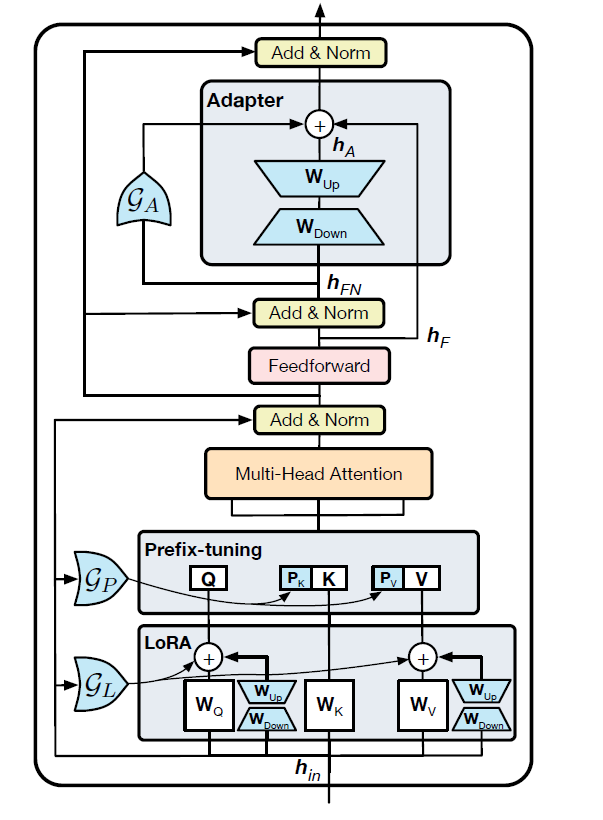
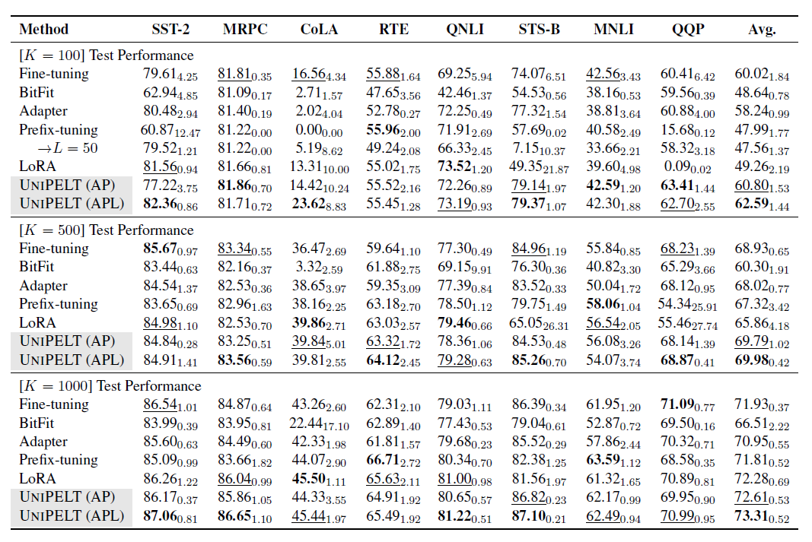
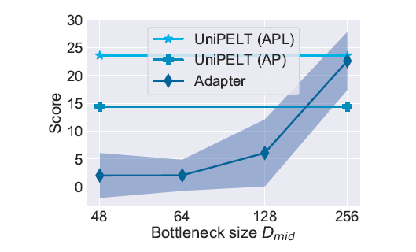
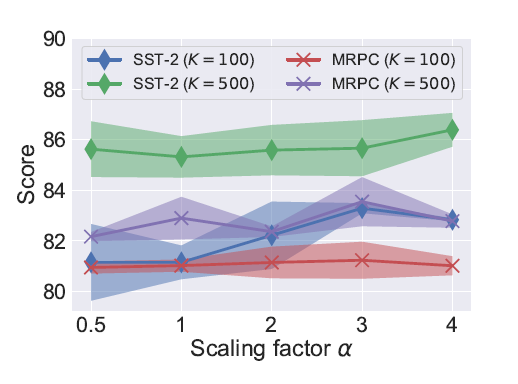
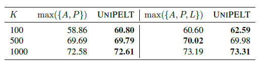
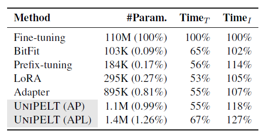

# UNIPELT: A Unified Framework for Parameter-Efficient Language Model Tuning

> **太长不看版**
>
> 这篇文章介绍了UNIPELT，一个用于参数高效语言模型微调（PELT）的统一框架。传统的精细调整方法在大型语言模型中十分困难，因此，PELT方法被提出，但它们在不同任务中表现不一，很难选择合适的方法。
>
> UNIPELT集成了多种PELT方法（Adapter、Prefix-tuning、LoRA）作为子模块，并通过门控机制动态激活最适合当前任务的方法。UNIPELT的目的是更好地理解和利用各种方法的差异，而不是提出另一种新方法。
>
> 在网络中，Adapter模块位于标准的Transformer层的前馈网络(feedforward)之后。它由一个下降投影$ W_{\text{down}} $和一个上升投影$ W_{\text{up}} $组成，构成一个瓶颈层，用于学习特定任务的表示。Adapter的输出$ h_A $与前馈网络的输出$ h_F $（残差连接，未归一化）相结合，再通过一个门控机制$ \mathcal{G}_A \in (0,1) $决定Adapter的激活程度（即$ h_A $的权重）。
>
> Prefix-tuning向每个Transformer层的多头注意力机制的输入前添加了特定于任务的、可训练的前缀向量$ P_K $与$ P_V $，这些前缀向量与原始的键（K）和值（V）向量结合，允许模型学习特定任务的表示，并通过门控机制$ \mathcal{G}_P $控制前缀向量的激活程度。
>
> LoRA方法通过在多头注意力机制的权重矩阵（如，$ W_Q $ 与 $ W_V $）中添加可训练的低秩矩阵$ W_{\text{down}} $与$ W_{\text{up}} $来调整预训练模型的权重，这种添加方式允许模型调整特定任务的表示，同时保持大部分预训练模型的参数不变，并同样通过一个门控机制$ \mathcal{G}_L $来控制低秩矩阵的激活程度。
>
> 在这个框架中，门控机制的作用是动态调整不同PELT方法的影响力。这种设计允许模型在不同任务或数据样本上激活最合适的微调策略，而不是一成不变地应用单一策略。这样，UNIPELT可以根据任务需求灵活地结合不同的微调方法，以提高整体性能和适应性。
>
> 在GLUE基准测试中，与其包含的最佳单独PELT方法相比，UNIPELT实现了1%~4%的性能提升。此外，UNIPELT通常超过了以每个任务上其他所有子模块单独使用的最佳性能，这也表明多种PELT方法的混合本质上可能比单一方法更加有效。

## 摘要

最近，参数高效的语言模型微调（Parameter-Efficient Language Model Tuning，PELT）方法成功地在训练参数远小于精细调整地情况下达到了相同的性能水平。然而，由于不同的PELT方法在相同任务上可能表现出不同的效果，因此很难在特定任务下选择合适的方法。基于这样的挑战，文章提出了一个统一的、称为UNIPELT的框架。该框架将不同的PELT方法作为子模块，并且通过门控制学习激活最适合当前数据或任务集的方法。这种框架在GLUE基准测试中，与其包含的最佳单独PELT方法相比，UNIPELT实现了1%~4%的性能提升。此外，UNIPELT通常超过了以每个任务上其他所有子模块单独使用的最佳性能，这也表明多种PELT方法的混合本质上可能比单一方法更加有效。

## 引言

随着语言模型的规模越来越庞大，传统的精细调整模型方法变得越来越困难。为了解决这个问题，最近出现了大量关于参数高效的语言模型微调（PELT）的研究，即如何使用更少的可训练参数有效地微调预训练语言模型（PLMs）。由于不同的PELT方法具有不同的特性，并且在相同的任务上性能不同，而且PELT方法和任务数量快速增长，因此针对特定任务，选择最合适的PELT方法并不容易。为此，文章提出了一个统一的框架，成为UNIPELT。它将不同的PELT方法作为子模块进行集成，并学习如何动态地为对给定任务产生积极贡献的子模块分配更多权重。此外，由于每个子模块引入的参数数量通常很少，因此组合多种方法会导致模型效率的损失可以忽略不计。

同时，文章对代表性的PELT方法进行了全面的研究，仔细研究了它们在性能和特性方面的差异和共性。

## 准备工作

### 无需额外参数的PELT方法

即将PLMs当作特征提取器，只调整顶部层或预测头，而不引入额外的参数，但是这种微调方法**通常**会导致性能退化，远远不如微调所有参数。最近提出的**BitFit**方法通过仅微调PLM的**偏置项**，在训练数据有限的情况下已被证明在某些任务上实现了与微调相媲美的性能。因此，文章选择BitFit作为此类别的代表进行分析。

### 带有额外参数的PELT方法

#### Adapter

冻结PLM主体，引入了一种名为“Adapter”的模块，由Adapter模块学习特定下游任务的知识。具体来说，就是通过在每个Transformer层的前馈网络之后增加一个可训练的瓶颈层（bottleneck layer)。这个瓶颈层包括一个下降投影和一个上升投影的配对，用于缩小和恢复token隐藏状态的大小。

将前馈网络经过残差连接与归一化后的输出记为$ h_{FN}  $ ，其隐藏大小（即原始维度）为 $ D_{\text{hidden}} $，瓶颈大小（即希望投影到的维度）为$ D_{\text{mid}} $，那么瓶颈层 $ h_{A} $ 的输出可以表示为：

$$
h_{A} = W^{\top}_{up} \varnothing (W^{\top}_{down}h_{FN})
$$

其中，$ W_{\text{down}} \in \mathbb{R}^{D_{\text{hidden}} \times D_{\text{mid}}} $，$ W_{\text{up}} \in \mathbb{R}^{D_{\text{mid}} \times D_{\text{hidden}}} $，$ \varnothing $代表一个非线性激活函数。

Adapter在小资源集中与微调性能相当，有时甚至更有效。后续研究将Adapter扩展到多语言和多任务集，并进一步减少其可训练参数，使其可以轻松地集成到UNIPELT中，作为传统Adapter的替代品。

#### 前缀调优

Prefix-tuning的核心思想是在每个Transformer层的多头注意力输入前添加一些特定于任务的、可训练的向量，允许模型学习特定任务的表示，从而改善模型在特定任务上的性能，而无需对预训练模型的大部分参数进行调整。

假设原始序列长度为 $ L_0 $，可训练向量（即前缀长度）为L，Transformer层输入$ h_{\text{in}} \in  \mathbb{R}^{D_{\text{hidden}} \times L_0} $。首先，$ W_Q, W_K, W_V \in \mathbb{R}^{D_{\text{hidden}} \times D_{\text{hidden}}} $将$ h_{\text{in}} $ 转换为Q、K、V。然后，在K和V前面添加两个前缀矩阵$ P_k, P_V \in \mathbb{R}^{D_{\text{hidden}} \times L} $。

为了稳定优化过程，前缀矩阵P通过前馈网络进行重新参数化：

$$
P' = W_{\text{up}} \varnothing (W_{\text{down}} P)
$$

其中，$ W_{\text{down}} \in \mathbb{R}^{D_{\text{hidden}} \times D_{\text{mid}}} $， $ W_{\text{up}} \in \mathbb{R}^{D_{\text{mid}} \times 2N_{layer}D_{\text{hidden}}} $，$ N_{layer} $ 表示Transformer的层数。这个网络的参数在训练后可以被丢弃，只需要保留每层的2个前缀矩阵 $ P_K, P_V $。

#### 加法方法

Additive Methods是一种对预训练语言模型（PLM）进行特定任务调整的方法。在这种方法中，经过微调后的模型参数被视为预训练参数（记为$ \Theta_{\text{pre-trained}} $）和任务特定差异（记为 $ \Delta_{\text{task}} $）的加和。其中，$ \Theta_{\text{pre-trained}} $是固定不变的，而会在其基础上添加一个新的模型参数，即 $ \Theta_{\text{task}}  = \Theta_{\text{pre-trained}} + \Delta_{\text{task}} $。这种方法有多种不同的实现方式，比如LoRA、diff pruning和sidetuning等。

以LoRA为例，它引入了可训练的低秩矩阵，并将这些矩阵与多头注意力中的原始矩阵结合。具体来说，就是为Q和V引入了两个矩阵$ W_{\text{down}} \in \mathbb{R}^{D_{\text{hidden}} \times D_{\text{mid}}} $ 和 $ W_{\text{up}} \in \mathbb{R}^{D_{\text{mid}} \times D_{\text{hidden}}} $，这些矩阵与原始的$ W_Q $与$ W_V $（$ W_Q, W_V \in \mathbb{R}^{D_{\text{hidden}} \times D_{\text{hidden}}} $）一起使用：

$$
Q = (W_Q^{\top} + \alpha W^{\top}_{\text{up}} W^{\top}_{\text{down}})h_{\text{in}}
$$

其中，$ \alpha $是一个固定的标量超参数，用于缩放任务特定的差异。

与Adapter或Prefix-tuning中的可训练矩阵类似，LoRA的可训练矩阵形式相似，但它们之间没有非线性激活函数$ \varnothing $。这种方法的优点是可以灵活地调整模型的特定部分，从而更好地适应特定任务，同时保留预训练模型的大部分参数不变。

## 统一的PELT方法

### 任务制定

假定有一个大型PLM模型$ \mathcal{M} $，其大小为$ | \mathcal{M} | $，由于计算或存储成本的原因不能直接进行精细调整。整体的目标是设计一个统一的PELT框架，该框架将一系列可忽略可训练参数的PELT方法作为子模块集成进来，并能够在不同情境下动态激活这些子模块，以实现在不需要手动尝试各种方法、任务和数据组合的情况下，同时获得模型的效果和鲁棒性的令人满意的结果。

### 提出的方法

#### 动机与直觉

不同的PELT方法表现出多样化的特性，并且在相同任务上表现出不同的性能。此外，不同的PELT方法通常涉及PLM架构的不同部分。这使得我们可以将多个PELT方法组合在一起，而不产生直接的相互干扰。

UNIPELT通过两个关键因素提高了性能（与单一PELT方法对比）。首先，它会在不同任务或数据样本中动态激活（提高权重）最适合的子模块，并停用（减小权重）其他子模块。其次，在使用多个PELT方法时可能存在一些复合效应，从而提高了模型的效果。

#### 门控机制

UNIPELT引入了一种门控机制，用于精细控制每个Transformer层中的子模块（前面提到的Adapter、Prefix-tuning与LoRA）的激活或停用。每个子模块都有一个可训练的门，用于确定其在特定数据-任务集下的重要性。

具体来说，对于Adapter，文章设计了一个门函数$ \mathcal{G}_A \in (0, 1) $，该门函数采用使用sigmod激活函数的前馈网络来估计Adapter的重要性，并通过$ h_{\text{FN}} $生成。记Adapter输入（归一化之前的输入）为$ h_F $，输出为$ h_A $则其最终输出为：

$$
h'_A = \mathcal{G}_A h_A + h_F
$$

因此，若$ \mathcal{G}_A $趋近于0，则Adapter模块将近似被绕过。

类似地，对于Prefix-tuning，也有一个相应的门函数$ \mathcal{G}_P $，应用于词缀向量$ P_K $与$ P_V $。这个门函数是根据Transformer层的输入$ h_{\text{in}} $与另一个前馈网络估计的。

对于LoRA，其原始设计中已经有一个常数缩放因子 ，类似于门控制机制的目的。因此，我们只需通过第三个前馈网络，以$ h_{text{in}} $作为输入，使每层的因子成为可学习的，而不是手动指定一个常数，即：

$$
\Theta_{\text{task}} = \Theta_{\text{pre-trained}} + \mathcal{G}_L \Delta_{\text{task}}
$$

虽然UNIPELT看起来简单，但在不同情境下使其表现良好并不容易，因为简单地混合不同的PELT方法可能会导致性能混合或更差。这需要仔细的设计和调整，以实现在多个子模块之间的协同效应，从而提高模型的效果。

## 实验

### 任务设置

作者在通用语言理解评估（GLUE）基准测试上进行实验。该基准测试包括四种类型的自然语言理解任务，包括语言可接受性（CoLA）、情感分析（SST-2）、相似性和释义任务（MRPC、STS-B、QQP），以及自然语言推理（MNLI、QNLI、RTE）。作者排除了WNLI数据集，这是根据先前的研究的做法。

### 数据设置

主要考虑了资源有限的情境，其中训练数据有限，不同方法的性能差异较大。作者从每个任务的训练集中采样了一个较小的子集，其大小为K = {100, 500, 1000}。

在每个设置下，最佳和次佳方法以粗体和下划线表示。

性能随着Adapter的瓶颈层大小增加而发生了变化（在CoLA上，K = 100）。

对LoRA的各种缩放因子在2×2任务和数据设置上的性能比较。

UNIPELT和取其子模块在每个任务上的最佳性能的上限之间的平均测试性能比较。

相对于精细调整，可训练参数的数量以及训练、推断时间的比较。

## 相关工作

### 参数高效调整的PLM

由于越来越难以为各种下游任务训练和存储大型PLM的完整副本，如何以较少的可训练参数有效地调整PLM变得至关重要。现有的PELT方法可以基本分为两类，取决于是否引入新的可训练参数。具体而言，一种方法是只训练模型的一部分参数，如预测头和偏置项，或者在PLM的不同部分引入任务特定的参数，例如在多头注意力之前或在前馈层之后。随着PELT方法数量的不断增加，UNIPELT的目的是更好地理解和利用各种方法的差异，而不是提出另一种新方法。

## 专家混合

UNIPELT还与涉及高容量网络并根据不同输入激活（增加权重）网络的不同部分的方法相关。一个显著的例子是专家混合，它维护一组专家（神经网络）和一个或多个可训练门，根据每个输入选择特定于该输入的专家组合。尽管在概念上类似，但UNIPELT与MoE不同。UNIPELT中的子模块不像MoE那样明确地通过求和组合，而是按顺序隐式地影响彼此。此外，UNIPELT中的“专家”是多样化的，而MoE方法通常是同质化或相同的。

## 结论

在本文中，作者对代表性的参数高效的语言模型调整（PELT）方法进行了全面研究，并提出了一个统一的框架，该框架将不同的PELT方法作为子模块集成，学习如何激活最适合给定任务或数据设置的子模块。我们提出的框架在不同情况下一贯地优于传统的精细调整方法以及它所包含的子模块，并通常超过了每个子模块在每个任务上单独使用的最佳性能的上限。

研究结果表明，涉及PLM不同部分的多种PELT方法的混合可能有利于提高模型的效果和鲁棒性。未来工作方向包括更好地理解不同情景下各种PELT方法的差异，以及研究多任务设置，即在任务级别激活和协作多个子模块。
