# ReLLa: Retrieval-enhanced Large Language Models for Lifelong Sequential Behavior Comprehension in Recommendation

ReLLa：检索增强的大型语言模型用于推荐中的终身序列行为理解

> 太长不看版
> 
> 本文提出了一种新颖的框架，即检索增强的大型语言模型（*ReLLa*），用于零样本和少样本设置中的推荐任务。对于零样本设置，通过采用语义用户行为检索（*SUBR*），即以用具有与目标项目相关的前K个语义上相关的行为替换简单截断的前K个最近行为，来提高测试样本的数据质量。对于少样本设置，作者提出了全新的检索增强的指令调优（*ReiT*），采用*SUBR*作为数据增强技术，构建了一个包括原始数据样本和它们的检索增强对应样本的混合训练数据集，并在在混合训练数据上对*LLMs*进行指令调整。本文通过一系列在真实世界数据集上的对比实验（包括修改*ReLLa*中的各类组件以验证其有效性），证明了*ReLLa*相对于现有基准模型的优势。

## **摘要**

本文着重于调整和赋能纯大型语言模型来进行零样本和少样本推荐任务。笔者首先确立并阐述了LLM无法从长用户行为序列的文本背景中提取有用信息，即使上下文的长度远未达到LLM的上下文限制这一问题。为了解决这个问题并改善LLM的推荐性能，作者提出了*ReLLa*，即检索增强的大型语言模型。对于零样本推荐，作者进行语义用户行为检索（SUBR）来提高测试样本的数据质量。对于少样本推荐，作者进一步设计了检索增强的指令调优（ReiT），通过采用SUBR作为训练样本的数据增强技术。作者在三个真实世界公共数据集上进行了大量实验，证明了ReLLa相对于现有基准模型的优势。作者特别强调仅有少于10%的训练样本的少样本设置ReLLa表现超过了在整个训练集上训练的传统CTR模型（例如，DCNv2、DIN、SIM）。

## 1 **导论**

作者首先在图一中用数据证实了LLM无法从长用户行为序列的文本背景中提取有用信息，即使上下文的长度远未达到LLM的上下文限制这一问题。

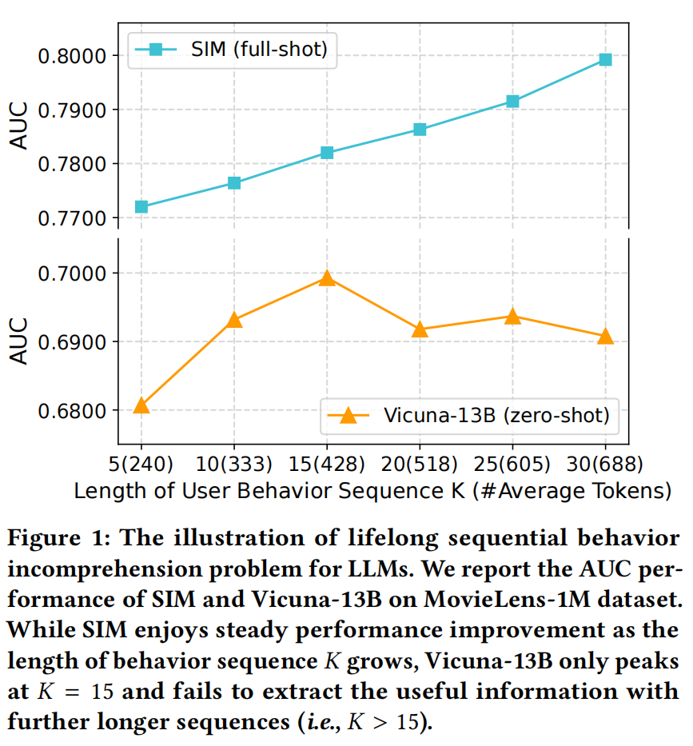

图1：大模型**不理解终身序列行为**的问题

Vicuna-13B在sequence的数量大于15时AUC值即开始下降，远远少于其设定的最大token数2048。

因此，作者认为，在推荐领域中，LLMs对长用户行为序列的理解问题是特殊的，需要根据给定的用户配置文件和行为历史推断用户对某个候选项目的偏好。

为了解决该问题，本文提出了检索增强型大型语言模型（ReLLa），用于零样本和少样本设置下的推荐任务。对于零样本推荐，本文建议进行语义用户行为检索（SUBR），以用具有与目标项目相关的前𝐾个语义上相关的行为替换简单截断的前𝐾个最近行为。对于少样本推荐，作者还提出了检索增强型指令调整（ReiT），将SUBR应用于训练样本作为数据增强技术，获得了由原始和检索增强的训练数据样本组成的混合训练数据集，从而提高了LLMs的鲁棒性和泛化能力。作者强调仅通过少样本的训练样本，ReLLa可以胜过使用完整训练集进行训练的全样本传统推荐模型。作者认为本文主要有以下三大贡献：

-   作者认为他们是首先确立并阐述了LLM无法从长用户行为序列的文本背景中提取有用信息，即使上下文的长度远未达到LLM的上下文限制这一问题的团队。
-   作者提出了ReLLa这一框架来促进解决上述问题，设计了SUBR来提高零样本推荐训练样本的数据质量，并进一步提出了检索增强指令调优（ReiT），通过混合原始和检索增强训练样本来提高少样本推荐性能。
-   作者在三个真实世界的公共数据集上进行了大量实验，验证了本文的方法与现有*baselines*相比的优越性。（前提在ReLLa使用少样本与零样本设置，现有*baseline models*采用全样本设置）。

## 2 **预备**

文中重点关注点击率（CTR）预测，它在推荐系统中是一个核心组成部分，用于估计用户在给定特定上下文情境下对目标项目的点击概率。

### 2.1 零样本和少样本推荐

传统的推荐模型无法完成零样本推荐任务，因为它们是随机初始化的。然而，大型语言模型具有丰富的开放世界知识和逻辑推理能力，作者认为其可以在零样本设置下的推荐领域中取得更好的成果。

而对于少样本设置，作者认为这要求模型能以有限的数据进行高效的训练。作者在此一并定义全样本设置为在整个训练集上的训练。

### 2.2 文本输入输出对公式

对于LLM来说，需要将每个数据样本通过固定的提示模板（*hard prompt templates）*转化为文本段进行输入。同时，将输出的二元标签转化为“Yes”或“No”两个选项。图二为一对输入输出的示例：

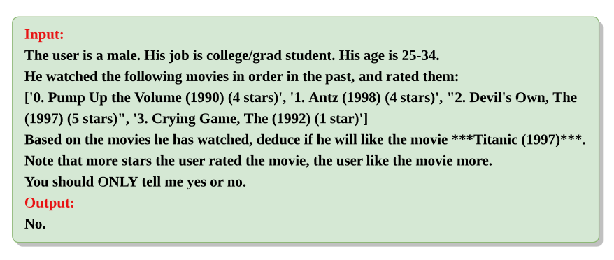

图2：输入输出对示例

对于每个输入，本文中的ReLLa提出进行语义用户行为检索，以构造具有与目标项目相关性最高的𝐾个行为的文本输入。

### 2.3 使用LLM的逐点评分

作者将LLM对于输入输出的处理简单表述为下图：

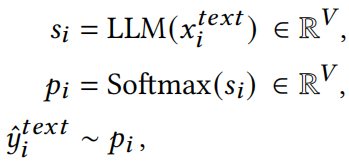

V为词汇量大小。

作者随即指出点击率（*CTR*）预测要求模型进行点对点评分，输出应为浮点数，而不是离散标记。作者在此引用了先前相关工作中的方法，截取估计的分数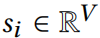，并对二进制答案的相应分数进行双向Softmax。假设"是"和"否"的词汇索引分别为𝑎和𝑏，则LLMs对于CTR预测的点对点评分可以表示为：

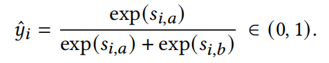

值得注意的是，这样估计的点击率仅用于测试集的评估。如果有训练，作者将保留LLMs的常见指令调整和因果语言建模范式。

## **3 方法**

在本节中，作者详细介绍了ReLLa框架。

### 3.1 ReLLa概述

本文为ReLLa框架在零样本与少样本设置下的推荐认为分别开发了两个关键技术。

对于零样本推荐，如图3所示，作者提出进行语义用户行为检索（*SUBR*）。

图3：语义用户行为检索（*SUBR*）的说明

对于少样本推荐，如图5所示，作者提出进行检索增强指令调优（ReiT）。

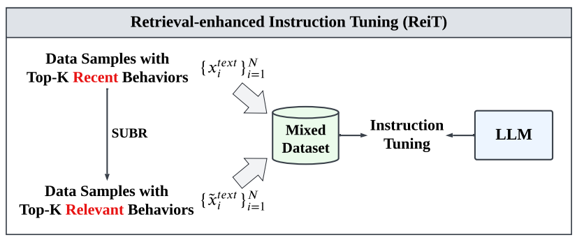

图5：ReiT技术说明

作者再次强调ReLLa是在少样本设置下调优，而其他推荐baseline models都是在全样本设置下进行训练。

### 3.2 语义用户行为检索

首先，本文进行语义项目编码，以获得每个项目的语义向量。对于池中的第𝑡个项目，通过固定的提示模板构建一个描述性文本，然后通过LLM进行输入。对LLM最后一层的所有隐藏状态进行平均池化，得到一个向量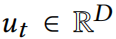，其中𝐷是LLM的隐藏层大小。接下来进一步使用PCA模块进行维度约减和去噪处理，生成最终的语义表示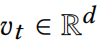，d被设置为512，通过计算它们相应的语义表示之间的余弦相似度来测量每对项目之间的语义相关性。

接下来对每个测试样本应用SUBR，将原始截断的前𝐾个行为替换为与目标项最相关的𝐾个行为。于是获得了一个平行的经过检索增强的测试数据集，具有更高的数据质量，同时保持输入上下文的长度大致不变。

### 3.3 检索增强指令调优

作者否定之前科研工作的做法，认为简单的指令调整可能会使大型语言模型在有限的训练数据上过拟合和遗忘，并提出了一种新的增强型指令调整方法（ReiT），其中采用语义用户行为检索（SUBR）作为数据增强技术，构建了一个包含丰富用户行为模式的混合训练数据集，并在混合训练数据上对LLMs进行指令调整。

作者采用因果语言建模来维持原有模型的结构：

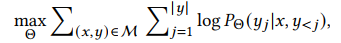

其中Θ是LLM的参数，M是包含总共2**N**个数据样本的混合训练数据集，是文本输出𝑦的第𝑗个标记，表示标记之前的标记。

## **4实验**

本节中作者进行实验，以回答以下问题：

**RQ1** ReLLa与现有baselines相比表现如何?

**RQ2** ReLLa是否提升了LLM对推荐任务的终身顺序行为理解能力?

**RQ3** 𝑁的数量对性能的影响如何？

**RQ4** ReLLa的不同组件对性能的影响是什么？

**RQ5** ReLLa如何帮助LLM更好地理解用户行为序列？

### 4.1实验设置

#### 4.1.1数据集。

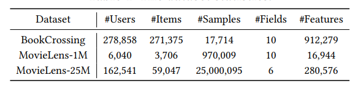

表1：数据集统计

#### 4.1.2评价指标。采用AUC(area under the ROC curve),Log Loss(binary

cross-entropy loss)和ACC(accuracy score)。

#### 4.1.3 Baseline Models。

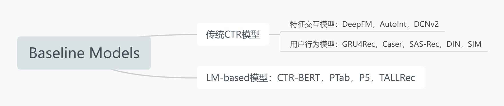

#### 4.1.4实现细节。

选择FastChat4发布的Vicuna-13B作为ReLLa的基础LLM。

在构建ReLLa的难度提示模板时，作者删除了所有纯ID字段，因为LLMs对于纯ID文本的感知能力有限。其他字段被用作提示中的用户配置文件或物品信息。对于CTR baseline models，将所有特征字段和用户行为序列作为输入。

### 4.2总体表现

对于零样本推荐，观察到：

-   Vicuna-7B的性能在三个数据集上都明显低于其13B版本。这表明，更大的LLM具有更出色的语言理解和逻辑推理能力，从而导致更好的零样本用户偏好推理能力。
-   除ReLLa在MovieLens-25M上的AUC性能外，ReLLa明显优于Vicuna-13B。这证实了SUBR能有效降低LLM从用户行为序列中提取有用信息的难度。同时，在MovieLens-25M上AUC的降低也揭示了零样本 LLM在推荐领域中的不稳定性。

对于全样本和少样本设置，观察到：

-   SIM在所有基准模型中表现最好，因为SIM应用用户行为检索来降低噪声。此外，基于语言模型的CTR模型（如CTR-BERT、PTab、P5）的性能较ID-based传统CTR模型大多较差，因为这些基于语言模型的方法只使用了小型语言模型（如BERT、T5）进行纯文本推荐。
-   ReLLa（少样本）通常在所有基准模型上取得显著更好的性能。这验证了作者提出的检索增强指令调整（ReiT）在逐序推荐任务中的有效性，尤其在MovieLens-25M数据集上。

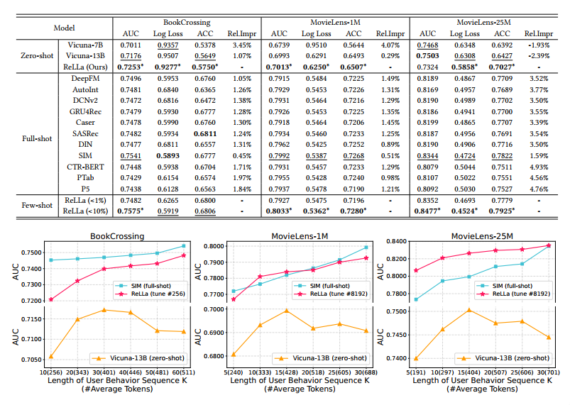

图6：不同模型在不同用户行为序列长度K下的AUC表现

### 4.3序列行为理解(RQ2)

作者对不同长度K的用户行为序列进行测试，以研究其对CTR的预测表现的影响，在BookCrossing数据集的测试中，K的取值为{10, 20, 30, 40, 50, 60};MovieLens-1M和MovieLens-25M数据集中，K的取值为{5, 10, 15, 20, 25, 30}。对于使用少样本的ReLLa，BookCrossing、MovieLens-1M和MovieLens-25M数据集的样本数量被分别设定为256、8192、8192。测试结果如图6，由此作者获得以下结论：

-   SIM作为传统CTR预测模型，其性能会随着K的增长稳步提升，符合常识。
-   然而，Vicuna-13B（零样本）在三个数据集测试中，分别在K=30、15、15时其模型评估指标AUC就达到了峰值，并在K继续增大后都呈现下降趋势，而此时的token数还远未达到2048tokens的上下文长度限制。这表明LLMs对推荐任务下长用户行为序列的上下文理解异常，需要相关领域内的知识。
-   ReLLa（少样本）与Vicuna-13B（零样本）相比，ReLLa在三个数据集的测试中，当K\>30、15、15时，模型评估指标AUC仍保持稳步增长。这验证了ReLLa对长用户行为序列的上下文理解能力。

**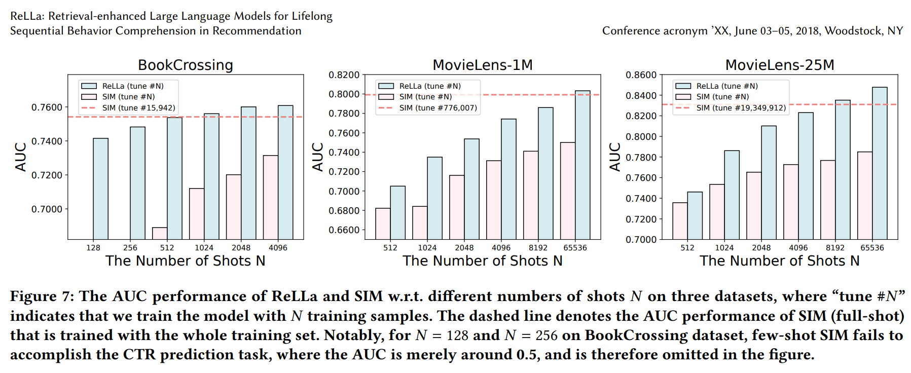**

### 4.4数据效率(RQ3)

在少样本设定中，作者主要研究了不同样本量N下的数据效率（到达相同性能时的样本量的倒数）。如图7所示，作者展示了ReLLa和SIM在不同N的取值下的AUC表现，并添加了SIM的全样本最佳AUC线作为参照。BookCrossing数据集中N的取值为{128, 256, 512, 1024, 2048, 4096}，MovieLens-1M和MovieLens-25M中为{512, 1024, 2048, 4096, 8192, 65536}。

如图7所示，ReLLa和SIM的性能表现都随着样本量N的增加而提升，在相同的N下，ReLLa的性能表现遥遥领先于SIM；当N取值较小时（128和256），SIM甚至无法完成BookCrossing的CTR预测任务（AUC几乎就是0.5）。在训练样本数有限的情况下，ReLLa表现出非凡的数据效率和可观的少样本推理能力。

### 4.5消融实验(RQ4)

为了分析ReLLa框架下各个组成部分的功能，作者设计了一些ReLLa的模型变体来进行测试，BookCrosing/MovieLens-1M/MovieLens-25M数据集的少样本量N被分别设为256/8192/8192，K被设为60/30/30.

-   **ReLLa (Ours)**是作者所设计的ReLLa完整框架，训练数据包括原始数据和检索增强数据（总计2N样本），测试数据只包括检索增强样本。
-   **ReLLa (w/o Mixture)**.训练集只保留了检索增强的数据（总计N样本），测试集不变。
-   **ReLLa (w/o Retrieval)**.训练和测试都使用原始数据（训练数据总计N样本），表示Vicuna-13B的普通指令调优版本，类似于TALLRec。
-   **ReLLa (1/2 N-shot)**.将所有数据集中采用的样本数从N减半到1/2N，以此构造出的混合训练集总计有N个样本。
-   **ReLLa (w/o IT)**.省去指令调优，表示ReLLa的零样本版本。
-   **ReLLa (w/o IT & Retrieval)**.省去指令调优，且测试数据只包含原始数据样本，表示Vicuna-13B的零样本版本。

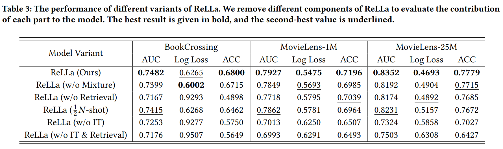

这些变体的性能见表3，通过分析可以得出以下观察结果：

-   对于ReLLa (w/o Mixture)和ReLLa (w/o Retrieval)，它们的训练和测试数据完全由原始样本或改进后的样本组成，即训练和测试阶段之间没有数据不一致性。然而，它们在三个数据集上AUC分别低于ReLLa(Ours) 1.12％，0.99％和1.95％。这凸显了数据混合策略的好处，即加倍的训练样本和模式丰富化。加倍的训练样本导致了更全面的训练过程，而模式丰富化可以防止模型过拟合，增加模型的鲁棒性。
-   为了进一步解耦，引入变体ReLLa(1/2𝑁-shot)分析上述两个因素。它相比ReLLa (w/o Mixture)和ReLLa (w/o Retrieval)少了一半的训练集。在这种情况下，ReLLa(1/2𝑁-shot)仍然优于前两者。这表明模式丰富化作为正则化对性能改进更重要。
-   ReLLa (w/o IT)相比ReLLa (w/o IT & Retrieval)基本上取得了显著的改进。这表明SUBR提高了数据集的质量，使过滤后的行为序列更有利于LLM提取有用的知识。

### 4.6案例研究(RQ5)

本节进行案例研究，进一步分析ReLLa如何帮助LLM更好地理解长期用户行为序列。如图8所示，选择了来自MovieLens-25M数据集的一个测试样本，在Vicuna-13B、ReLLa（零样本）和ReLLa（少样本）三种模型的最后隐藏层上，可视化目标项目在用户行为序列上的注意力分数。

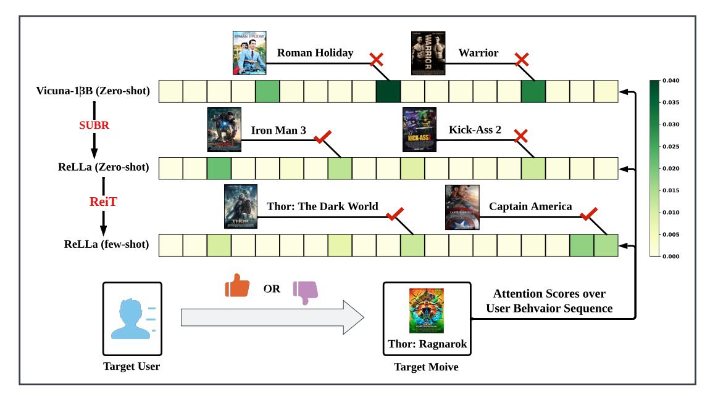

图8：ReLLa在MovieLens-25M数据集上的案例研究

每个历史项目的注意力分数是通过对文本输入的每个词标记的注意力分数求和。每个历史项目表示为一个矩形，矩形颜色越深绿，相应历史项目的注意力分数越大，对最终的CTR估计有更大的贡献。

对于Vicuna-13B（零样本），最大注意力的电影与目标电影几乎没有关系。通过使用SUBR，ReLLa（零样本）能够更多地关注与目标项目语义相似的超级英雄电影（例如《钢铁侠3》）。但ReLLa（零样本）仍然存在异常值。接着，通过ReiT，观察到ReLLa（少样本）的大注意力权重都集中在目标项目相关，即由漫威制作的超级英雄电影上。因此作者得出结论，SUBR和ReiT能够帮助LLM正确把握目标项目与历史项目之间的相关性，更好地理解用户行为序列。

## **5相关工作**

### 5.1传统CTR预测

作者简单介绍了两种CTR预测模型：基于特征交互的模型利用不同的运算符来捕捉特征交互模式，而序列推荐模型则侧重于用户行为建模。

### 5.2推荐的语言模型

根据推荐流程中的角色，LLMs可以应用于特征工程、特征编码器和评分/排名函数。文中关注LLMs作为评分/排名函数的应用，提出ReLLa框架，通过引入检索技术来提高LLMs的理解能力，从而增强其推荐性能。

## **6总结**

在本文中，作者的重点是提升LLMs作为推荐任务的评分/排名函数的性能。首先，作者阐述了LLMs在终身序列行为上的理解问题，即LLMs无法从长用户行为序列的文本环境中提取有用信息，即使上下文的长度远未达到LLMs的上下文限制。因此，作者提出了ReLLa框架，其中设计了语义用户行为检索（SUBR）和检索增强指令调整（ReiT）来解决这个问题。广泛的实验验证了ReLLa相对于现有基准模型的有效性。具体而言，少样本ReLLa仅使用不到10%的训练样本，能够胜过所有以整个训练集训练的全样本传统CTR模型。这证明了ReLLa的数据效率优势，以及对长用户行为序列的理解能力。
