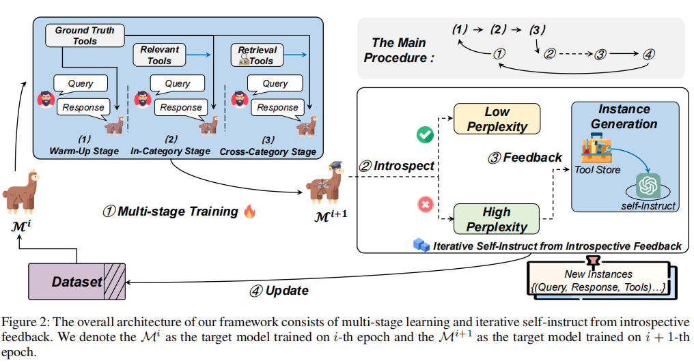
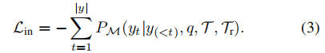

# Confucius: Iterative Tool Learning from Introspection Feedback by Easy-to-Difficult Curriculum

孔子：通过从易到难的课程从内省反馈中迭代工具学习

## 摘要

使用外部工具增强大语言模型（LLM）已经成为扩展LLM能力的一种有效方法。现有的大多数工作都是在一个受控的环境中进行训练的，其中LLM只能学习执行人类提供的工具；并且直接采用自指导的方法对模型进行训练，这忽略了工具复杂性的差异。**从大型工具集中选择合适的工具**也是工具学习模型应用于现实世界应用的关键能力。在本文中，作者提出**孔子**工具学习框架，通过**多阶段学习**、**迭代自指导**和**反思反馈**（ISIF）等策略，使 LLM 能够更好地掌握各种工具。大量实验表明，本文的工具学习框架比**无调优**（如ChatGPT，Claude）和**基于调优**的基线（如GPT4Tools）都具有优越性。代码已开源 https://github.com/shizhl/CTL

## 1 引言

工具学习的任务旨在释放大语言模型（LLM）的力量，以有效地与各种工具进行交互，以完成复杂的任务。现有的工具学习方法分为两种：**无调优**和**基于调优**的方法。

**无调优**方法利用专用的LLM（如ChatGPT，GPT4）与各种工具进行交互，通过prompt使LLM访问用户定义的工具。因此，LLM有限的上下文长度限制了大量工具的应用。

**基于调优**的方法通在复杂的数据集上训练来微调开源LLM。首先使用自指导技术从专有的LLM中收集工具使用数据，然后对开源模型进行微调。由于训练数据只包含有限范围的工具，大多数方法缺乏泛化到看不见的工具（训练数据之外的工具）的能力。表1列出了几个尖端的工具学习方法。

如图1所示，大多数现有的方法直接为LLM提供了一个最小的基本工具集，而不需要多余的工具。然而，当适应现实世界的应用程序时，LLM通常面临一个跨不同任务包含不同工具的大型工具集。因此，如何教LLM从候选工具集中选择合适的工具成为**第一个挑战**。

使用不同工具的困难程度不同，有些工具在不同的场景中以不同的方式使用，因此在模型训练过程中应该更加注意这些复杂的工具。因此，**第二个挑战**是让LLM知道哪些工具更复杂，以及如何提高使用这些工具的能力。

本文提出了**孔子**工具学习框架来训练LLM在现实世界的场景中使用复杂的工具。孔子包含两个主要阶段： (1)为了应对第一个挑战，本文首先提出了一种**多阶段学习**方法，通过容易到困难的课程教LLM使用各种工具；(2)为了应对第二个挑战，本文提出了一种**迭代自指导**和**反思反馈**（ISIF）技术来动态构建数据集，以提高对复杂工具的使用能力。

本文的贡献可以总结如下：

（1）提出了**孔子**工具学习框架，教LLM在现实场景中使用复杂的工具。

（2）提出了一种**多阶段学习**方法来提高从大型工具集选择多种工具的能力。

（3）提出了一种迭代训练策略ISIF，根据模型自我反思动态更新数据集，来提高使用复杂工具的性能。

（4）在可见和不可见工具集上的实验表明，孔子有效地访问了各种工具，并实现了与专有LLM（如ChatGPT）相媲美甚至更好的性能。

## 2 相关工作

### 2.1 无调优的工具学习

无调优方法利用了LLM固有的上下文内学习能力。将工具演示作为输入，提示LLM使用各种工具。存在以下缺点：

- 出于数据安全的原因，并非所有的应用程序都可以将工具和用户数据传输给LLM服务提供商。在此类应用程序中使用专有的LLM受到限制。
- 由于输入长度的限制，提示不能容纳大量的工具，因此限制模型只能使用少数工具来处理任务。

### 2.2 基于调优的工具学习

基于调优的工具学习方法直接在工具使用数据集上微调模型参数，数据集通常通过提示专有LLM使用特定工具来生成。

然而，在构建的数据集上的微调模型通常会引入泛化问题，在处理在训练中没有看到的新工具时，通常会观察到性能下降。现有工作忽略了各种工具之间的复杂性区别，降低了模型的泛化能力。

## 3 任务制定

将孔子制定为一个工具学习框架，来训练开源大型语言模型$\mathcal{M} $。基于大型工具集$\tau^*$构建工具使用数据集$D$，并将这些工具分为不同的类别（10类）。数据集中的每个实例由**查询**$q=\{q_1,q_2,...,q_{| q |}\}$，**响应**$y=\{ y_1,y_2,...,y_{|y|} \}$和**工具**$\tau=\{ \tau_1,\tau_2,...,\tau_{|\tau|} \}$组成。将**相关工具集**表示为$\tau_r$，它来自与$\tau$来自相同的类别，与$\tau$没有重叠。训练目标模型$\mathcal{M}$通过组合推理将原始查询$q$分解为子任务，并逐步安排适当的响应$y$。在推理过程中，首先根据查询$q$检索$\tau^*$的子集$\widetilde{\tau}=\{ \tau_1,\tau_2,...,\tau_{|\widetilde{\tau}|} \}$，其中包含生成响应的候选工具。

图2展示了孔子的整体架构，分为两个主要部分： 

(1)给定一个工具使用数据集，提出了一种多阶段学习方法，在一个简单到困难的课程范式中调整LLM；

(2)在调整LLM后，根据微调的LLM引起的**混淆集**动态更新数据集。不断地使用更新后的数据集来微调LLM，并以迭代的方式进行训练。

## 4 多阶段学习

与人类学习过程类似，工具学习模型可以从简单到困难的课程中获益。本文提出了一种多阶段学习方法，包括**热身训练**、**类别内训练**和**跨类别训练**，教LLM在现实世界中掌握各种工具。

### 4.1 热身训练

在热身训练阶段，向模型提供所需的最小工具集，目的是教模型正确地调度和执行工具。

对于每个查询$q$，向LLM$\mathcal{M}$提供工具$\tau$来生成响应$y$，表示为：

然后使用对数似然目标$L_{warm-up}$训练$\mathcal{M}$将查询分解为可使用工具的子任务，并通过调度多个工具生成响应$y$：

### 4.2 类别内训练

为了逐步使模型适应真实世界的设置，对于每个查询，整合了工具集$\tau$和相关的工具集$\tau_r$。在这种情况下，除了为模型安排适当的工具外，还需要首先从候选工具$\tau \cup \tau_r$中选择适当的工具。而LLM根据查询$q$和混合工具集$\tau \cup \tau_r$生成响应，可以表述为：

### 4.3 跨类别训练

由于用于回答查询的工具应该是自动检索的，而不是在实际应用程序中手动提供的，因此引入了跨类别训练方法，它使LLM能够在现实设置中选择适当的工具。

首先构建了一个基于双编码器框架的工具检索器模型来检索候选工具集$\widetilde{\tau}$，它将用户查询$q$和工具演示编码为密集表示，并计算余弦相似性作为相关性。$\widetilde{\tau}$包含了容易让LLM混淆的冗余工具。因此，将$\tau$和$\widetilde{\tau}$的并集作为每个训练示例的候选工具集。然后监督LLM从候选工具集$\tau \cup \widetilde{\tau}$中选择合适的工具，并生成对查询$q$的响应，可以表述为：

## 5 从反思中迭代自指导

为了对复杂的工具进行更有针对性的训练，本文提出了从反思反馈中迭代自指导（ISIF），它基于工具的模型知识不断更新训练数据集。如图2所示，ISIF包含两个阶段：实例生成和使用内部反馈更新数据集。

### 5.1 初始数据集构建

首先手动构建包含110个常用工具和使用实例的工具存储区。每个实例都由一个具体的查询组成，答案遵循思维链格式，其中至少涉及到四个工具来保证数据集的复杂性。

实例生成方法如图2所示：首先从工具存储中抽取5个~7工具，记为$\tau^*$。然后将抽取的工具的演示与相应实例进行配对作为输入，提示ChatGPT推理工具的潜在组合关系，生成不同的实例。

表2展示了一个prompt示例，由三个主要部分组成： (1)任务指令；(2)候选工具列表；(3)工具使用实例演示，每个实例包含一个用户查询和一个响应。

表3给出了与其他相关数据集进行比较的更多细节。

### 5.2 通过反思反馈更新

如果没有任何有针对性的培训指导，通过自我指导产生的实例是不受控制的，因此本文根据训练程序构建一个prompt来指导实例生成阶段。

给定一个包含n个token的查询$q=\{q_1,q_2,...,q_n\}$，首先检索一个工具集$\tau^*$，向LLM$\mathcal{M}$提供$\tau^*$来生成响应。包含m个token的响应$y=\{ y_1, y_2, ...,y_m \}$的困惑度$h$可以表示为：

其中$P_{\mathcal{M}}(y|q,\tau^*)$是生成概率，可以表示为：

困惑度$h$表示不确定程度，困惑度高的样本在后续训练中需要进一步训练。

接下来过滤出具有较高困惑度的实例$D^*$，以生成更多类似的工具使用实例，用于进一步的训练。实例生成方法与初始数据集构造相同（如5.1所示），只有prompt中的工具使用演示会被过滤后的实例$d^* \in D^*$所取代。

对于每个更新，生成相对原始数据集$\sigma$百分比的新实例，将这些实例附加到原始数据集$D$。更新数据集将用于在下一个epoch中训练模型，这个过程在每个epoch中迭代进行。

## 6 实验设置

### 6.1 数据集

采用了两个测试集：**可见**工具集和**不可见**工具集，每个工具集由2000个实例和10个工具组成。**可见**工具集中的所有工具都在训练集中使用，而**不可见**工具集中的工具在训练时没有使用。

### 6.2 评价指标

从四个方面进行评估：工具选择、参数正确性、组合推理和交互流畅性。

- 工具选择：计算生成响应和标注响应之间的NDCG得分。

- 参数正确性：度量工具的输入参数类型的正确性，从而验证LLM响应是否符合工具接口的模式。
- 组合推理：识别生成响应和标注响应中工具的拓扑顺序，并计算两个工具序列的ROUGE-L得分。
- 交互流畅性：计算ROUGE-1, ROUGE-2, 和ROUGE-L的平均值，作为生成响应和标注响应的相似性。表明模型是否理解工具的输出并提供流畅的响应。

此外，还采用人工评估：三名硕士学生以三分制评估50个随机抽样案例。主要评估以下两方面：(1)可执行性：多个工具被调用的逻辑顺序是否正确。(2)流畅性：模型生成的响应是否像人类一样流利。

### 6.3 基线

基于调优：*ToolFormer*-6B，ToolLLaMA*-7B，GPT4Tools

无调优：专有的LLM如ChatGPT和GPT-3），其他开源模型

为了进行公平的比较，所有基于调优的方法都使用和本文模型相同的数据集。所有基线都在候选工具集上执行，候选工具集由密集工具检索模型检索（如4.3所示）。使用余弦相似度最高的前10个工具作为候选工具集。

### 6.4 实施细节

基础模型：LLaMA-7B2为

在{10、15、20、25、30}中改变了σ的百分比，并发现σ = 20达到了最好的性能。

使用深度速度ZeRO策略（Rasley et al. 2020）对模型进行优化，学习速率为$5e^-5$，权重衰减系数为0.01。

使用4个NVIDIA A100-PCIE-80GB GPU，可以在20小时内完成。

## 7 实验结果

### 7.1 总体性能

表4显示了所有基线的实验结果。

与ChatGPT相比，孔子在可见测试集中的工具选择方面得到了88.61，说明孔子在正确的选择合适的工具方面性能更好。

孔子在可见和不可见工具集的组合推理方面达到87.99和63.65，与基于调优的基线相比有显著的改进，也优于先进的专有LLM（即ChatGPT）。这一结果突出了孔子受益于思维链的工具使用实例来进行组合推理。

在不可见工具集中，孔子优于无调优方法ChatGPT和Claude，将工具选择的分数提高到59.79，表明孔子实现了有效的广义工具使用能力。

以前基于调优的基线在从看到到看不见的工具集时，性能会下降。例如，GPT4Tools的组合推理得分为74.07分，而在未看到的工具集中只有46.21分，相对下降了37.61%。ToolLLaMA也观察到同样的趋势（相对下降45.04%）。相比之下，孔子的推理水平略有下降组合推理的得分仅相对下降了27.65%。潜在的原因是LLM可以从迭代训练策略ISIF中获得强大的工具使用能力。

所有基线的候选工具集都是自动检索的，也验证了本文工具检索的有效性。工具检索的top10召回率在可见和不可见工具集中达到了93.49%和91.20%。结果表明，具有双编码器体系结构的工具检索器能够找到与标注紧密一致的合适工具。

### 7.2 人工评估

表5总结了人工评估结果。

孔子在两个方面始终优于基于调优的最佳基线，例如使用可见的工具集将可执行性提高到2.73。

此外，孔子与ChatGPT取得了类似的结果，甚至是更好的结果，这表明了我们的框架的有效性。两个评价指标的平均Kappa统计量分别为0.762和0.732，说明了两者之间的一致性。

### 7.3 多阶段学习分析

表4中展示了消融实验结果。可以发现，所有的变体模型都存在性能下降，这证明了我们在孔子身上提出的多阶段训练方法的有效性。在工具选择分数方面，没有$L_{cross}$的模型的性能下降最大。这一现象表明：需要构建一个类似于现实世界设置的候选工具集，以提高LLM的工具选择能力。

### 7.4 ISIF分析

探讨性能的提高是否仅仅是由于训练集的扩展，以进一步验证了在ISIF中进行反思反馈的必要性。为了进行公平的比较，与不同于ISIF根据高困惑实例更新数据集不同，随机抽取一些实例作为自我指示生成新实例的提示。然后，利用更新后的数据集来训练LLaMA（与孔子相同的基础模型）。图3显示了在不同大小的初始数据集上训练的模型的性能。

我们发现，本文提出的ISIF在每个大小的数据集上都比直接训练的模型表现更好，这验证了在反思反馈引导下动态更新数据集的有效性。

### 7.5 对不同基模型的泛化

为了进一步探索孔子的健壮性，在相同的设置下使用孔子优化了另外两个开源LLM（LLaMA2- 7B和Vicuna-7B）。如表4所示，与相应的无调优版本相比，使用孔子训练的两个模型都大大优于它们的基础模型，证明了框架的泛化能力。

### 7.6 更新百分比的定性分析

本节探讨数据更新百分比对最终性能的影响。在图4中，将数据更新百分比σ从10%变化到30%。当σ的百分比从10%变化到20%时，性能持续增加，峰值在20%。

从结果中可以看出，随着动态更新百分比的增加，性能也得到了提高。这一现象可以证明我们提出的内省反馈更新的有效性。但随着更新百分比继续上升到30%，性能开始下降。一个可能的原因是：过多的针对性的工具使用实例引入了分布偏差，导致模型过度拟合了一些特定的工具，从而减少了模型的泛化。

## 8 结论

在本文中提出了孔子，一个新的工具学习框架来教LLM掌握各种工具，它包括两个主要步骤： (1)多阶段学习和(2)通过反思反馈的迭代自我指导（ISIF）。通过一个简单易难的课程的三个学习阶段来微调LLM，即：热身，工具选择类别内的组合调整阶段，以及跨类别阶段。由于某些工具的使用在不同的场景下有所不同，需要更多的训练来充分理解使用情况，引入ISIF来基于模型反思迭代更新训练数据集。在可见和不可见的工具集上进行的大量实验表明，孔子可以提高LLM的工具学习性能。